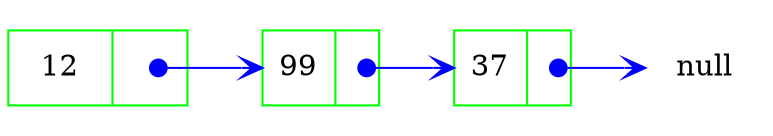
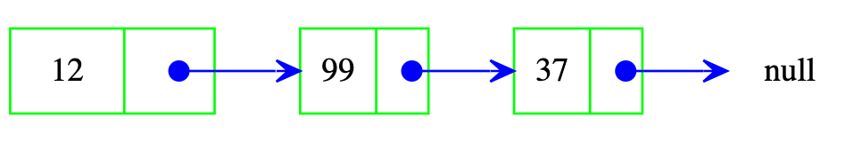

## Program 3 - Graphviz Class
#### Due: 03-02-2023 (Thursday @ 2:00 p.m.)

## Overview

Write a class that will generate graphviz "dot" syntax so you can visualize the output of your data structures. Graphviz stands for "graph visualization" and provides a smart way to visualize linked data structures. For example the following code:


```DOT
digraph foo {
        rankdir=LR;
        node [shape=record]
        null [shape=circle,color=white];
        1 -> 2 
        2 -> 3
        3 -> null
}

```

Creates the following output: 




Creates the following output: 




## Requirements


## Tests

Run this code with your class and make sure you get the same output. The example below uses method names that I might use. You can use any method names you want, as long as they are descriptive and give same output. 

I want your test program to write to stdout AND a file called `test.out`. Your name, date and course (Fall 2143) should be written at top of output file (with your code):

**Example Output File (portion of)**
```
Name
Date
Fall 2143

digraph foo {
        rankdir=LR;
        node [shape=record];
        a [label="{ <data> 12 | <ref>  }", width=1.2]
        b [label="{ <data> 99 | <ref>  }"];
        c [label="{ <data> 37 | <ref>  }"];
        null [shape=circle];
        a:ref:c -> b:data [arrowhead=vee, arrowtail=dot, dir=both, tailclip=false, arrowsize=1.2];
        b:ref:c -> c:data [arrowhead=vee, arrowtail=dot, dir=both, tailclip=false];
        c:ref:c -> null      [arrowhead=vee, arrowtail=dot, dir=both, tailclip=false];
}

etc...
```

** Image Output **


**Example Code Run**
```cpp

List L;
L.addNode(5);
L.addNode(7);
L.addNode(9);
L.print();
```

### Deliverables

- Create a folder in your assignments folder called `P01`
- In that folder create a file called README.md
- Help with markdown: https://guides.github.com/features/mastering-markdown/
- Look at [this](../../Resources/02-Readmees/README.md) to help with your `README.md` file
- Create a banner for your program **(see [HERE](../../Resources/03-Banner/README.md))**.

```
2143 
P01
Name
```

- Print out your source code. Make sure it's **[commented](../../Resources/01-Comments/README.md)**.
- Print out your output file.
- Put your assignment on the lecture podium at the beginning of class.
- Staple everything in this order:
  - **1)** Banner (on top)
  - **2)** Source code (middle)
  - **3)** Output (bottom)
- Any hand writing on your assignment is reduction in 1 letter grade.
- Failure to follow instructions is a reduction in 1 letter grade.

