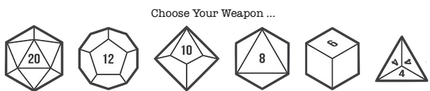

## Program 4 - Roll them Bones!

#### Due: 04-24-2023 (Monday @ 5:00 p.m.)

YES ... I KNOW THE DUE DATE IS MONDAY! Shut it...[^1].



### Helper Files

|  #  | Name                               | Description                                    |
| :-: | :--------------------------------- | :--------------------------------------------- |
|  1  | [dice.cpp](dice.hpp)               | [Example die/dice class](dice.hpp)             |
|  2  | [dice_tester.cpp](dice_tester.hpp) | [It tests the die/dice class](dice_tester.hpp) |

### Overview

The opening salvo we will be taking in the solving of the D&D battle royale program (and learning Python) is to convert the above two files into Python. Since `D&D` characters need to roll for many different things, we need to have a dice class handy. Could it be a simple function? Sure. But this dice class will do so much more! Most of it is implemented, but some is up to you.

The dice_tester file is just what it sounds like: a usage example for the dice class. In python you can combine both files into one without any issues. We have discussed the `__name__=='__main__'` concept alreay, but this program will put it to actual use. For those who have forgotten: The if `__name__=='__main__'` is a common concept used in Python programming to ensure that certain parts of a Python module are only executed when the module is run directly as the main program, and not when it is imported by another module.

**Filename:** dice.py

```python

class Die:
    # implement everything here
    pass

class Dice:
    pass

if __name__ == '__main__':
    """This code gets executed if you run this file directly: python dice.py
       It does not get executed if you import this file
       So do lots of testing below!
    """
    D1 = Dice('5.d.20')
    D2 = Dice('4.d.8')

```

**Filename:** main.py

All the tests in `dice.py` do not get run when you import the class(s)
into another file. However, the local `__main__` block will run if you call
this file like: `python main.py`

```python
from dice import Die
from dice import Dice


def dieTester(die, runs=10, testType="sum"):
    """Example function to test a die or dice.
    """
    if isinstance(die, Die):
    print(f"Testing {die.sides} sided die for {runs} rolls:")
    print("    [ ", end="")
    for i in range(runs):
        print(die.roll(), end=" ")
    print("]")
    else:
    print(f"Rolling {len(die.dice)} {die.sides} sided die {runs} times to get the {testType} value:")
    print("    [ ", end="")
    for i in range(runs):
        if testType == "avg":
        print(die.avg(), end=" ")
        elif testType == "min":
        print(die.min(), end=" ")
        elif testType == "max":
        print(die.max(), end=" ")
        else:
        print(die.sum(), end=" ")
    print("]")


if __name__ == '__main__':

  d1 = Die()
  d2 = Die(20)
  d3 = Dice(10, 5)
  d4 = Dice("8.d.20")

  dieTester(d1, 10)
  dieTester(d2, 20)
  dieTester(d3, 10, "max")
  dieTester(d3, 10, "min")
  dieTester(d3, 10, "avg")
  dieTester(d4, 20, "max")
```

Example output:

```
Testing 6 sided die for 10 rolls:
    [ 1 5 2 5 5 1 1 2 6 6 ]
Testing 20 sided die for 20 rolls:
    [ 17 14 2 16 10 1 6 12 19 7 17 17 1 15 15 5 20 6 16 14 ]
Rolling 5 10 sided die 10 times to get the max value:
    [ 8 7 9 10 10 10 9 9 8 9 ]
Rolling 5 10 sided die 10 times to get the min value:
    [ 5 1 4 5 5 1 4 1 2 4 ]
Rolling 5 10 sided die 10 times to get the avg value:
    [ 6.6 5.0 6.2 5.2 3.6 6.0 7.8 4.8 5.0 3.4 ]
Rolling 8 20 sided die 20 times to get the max value:
    [ 18 19 19 15 16 20 20 20 19 18 20 19 20 16 18 17 20 19 19 14 ]
```

### Requirements

- Implement the `Die` and `Dice` classes in Python, using the c++ code as a template.
- The standard roll is just to `sum` up all dice and return that value.
- Implement the `min`, `max` and `avg` roll methods that are not implemented as of yet.
- Place both of your class implementations in a file called: `Dice.py`
- Use the `__str__` method as a replacement for overloading ostream for both the `Die` and `Dice` classes.
- Use the `if __name__ == '__main__':`: syntax and write tests to ensure both of your classes work inside the `Dice.py` file.
- Create a `main.py` file and import your classes, to also ensure they work :)

### Deliverables

- Create a folder in your assignments folder called `P04`
- In that folder create a file called README.md
- Help with markdown: https://guides.github.com/features/mastering-markdown/
- Look at [this](../../Resources/02-Readmees/README.md) to help with your `README.md` file
- Create a banner for your program **(see [HERE](../../Resources/03-Banner/README.md))**.

````

2143
P04
Name

```

- Include your python file(s) inside the `P04` folder: `Dice.py` and `main.py`

---

[^1]: But shut it in a really nice way :)
```
````
