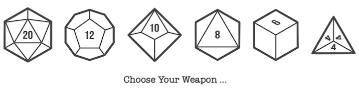

## Program 4 - Roll them Bones!

#### Due: 04-24-2023 (Monday @ 5:00 p.m.)

YES ... I KNOW THE DUE DATE IS MONDAY! Shut it1

### Helper Files

|  #  | Name                               | Description                                    |
| :-: | :--------------------------------- | :--------------------------------------------- |
|  1  | [dice.cpp](dice.hpp)               | [Example die/dice class](dice.hpp)             |
|  2  | [dice_tester.cpp](dice_tester.hpp) | [It tests the die/dice class](dice_tester.hpp) |

### Overview

The opening salvo we will be taking in the solving of the D&D battle royale program is to basically convert the above two files into python. As listed above, one is an implementation of a `Dice class` since D&D characters need to roll for many different things, and it seems they almost never use a six sided die, therefore we need to implement many sided die! The other

[1] : but in a really nice way :)
