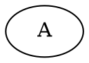
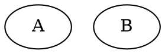
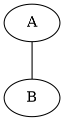
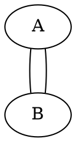
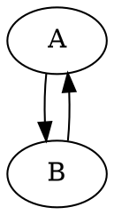
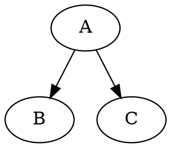
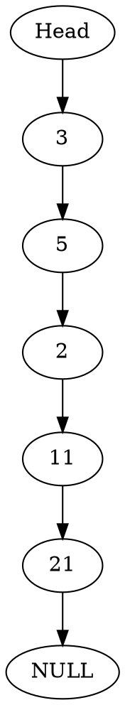
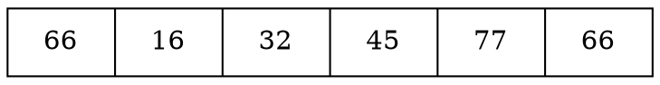
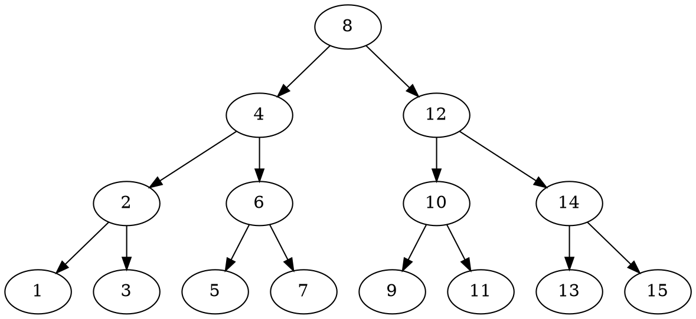

## Program 02 - Graphviz Class
#### Due: 03-25-2021 (Thursday @ 9:30 a.m.)

### Overview

`GraphViz` is a software library that takes a structured syntax and turns it into a visual representation of a "graph" (get it? "graph" "viz"). So it is meant for graph data structures, but it is also decent for other visual representations of arrays or structs. However, let us introduce ourselves to the bare bones basics. 

For our first example, lets create a `node` with the value `A` Notice the `A` is wrapped in two curly braces with the keyword `graph`. This defines it as an "undirected" graph (more in a minute about that):

**Code:**

**Result:** 

Whoa! Simple right? 

Lets add another node `B`: 

**Code:**

**Result:**

Easy enough! Let's add a relationship between `A` and `B`:

**Code:**

**Result:**

Can I add a relationship between `B` and `A`??

**Code:**

**Result:**

Yes I can, but this isn't always what we want. We need to show **direction**! We also need to change the keyword `graph` to `digraph` so `GraphViz` knows it's a directed graph.

**Code:**

**Result:**

Graphviz is also pretty smart about positioning your data structures so that they look as you would expect. Check out this "mini" binary tree: 

**Code:**

**Result:**

That is the "bare bones" basics of how to add "nodes" and then add "edges" between nodes. What if I wanted to print out a linked list of numbers? Here is my linked list: `Head->3->5->2->11->21->NULL`. This will be easy. 

**Code:**

**Result:**

Wait!?! Who draws linked lists like that? Lets fix it:

**Code:**

**Result:**

By now you should be realizing that even though this isn't photo shop, we still have a lot of potential. We haven't scratched the surface of the capabilities of `GraphViz` but we don't need to. I have a specific (sub)set of requirements for you to implement using `GraphViz`. That subset of requirements has (mostly) to do with with defining "nodes" seperately and then connecting them with styled edges as well. When we do this, we can "style" each node different (if we want), as well as each edge (again, if we want). Let us redraw the linked list using different styles for the head and null pointer nodes:

**Result:**

    

You should notice that we start to define the nodes at the top of the graph, and then we connect them afterwords. We can add generic definitions that account for all of them:

**Result:**

Each node is now shaped like a "record", except the nodes labeled with "Head" and "NULL". They keep their unique styling. 

    

For example, here is an array: 

Which results in: 

### Documentation

- Here Online: https://www.graphviz.org/pdf/dotguide.pdf
- Or in this folder: [docs](./dotguide.pdf)

### Online Graphviz Viewer

https://dreampuf.github.io/GraphvizOnline/

### VSCode Extension

Search For: `@popular graphviz` and install top result to allow you to preview graphs right in VSCode. 

#### Binary Tree Example
