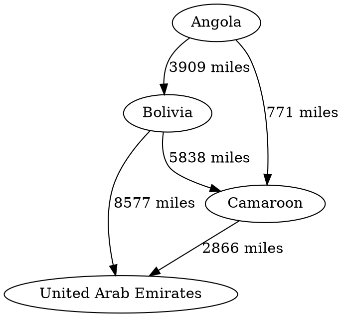

## Program 02 - Graphviz Class
#### Due: 03-25-2021 (Thursday @ 9:30 a.m.)

### Overview

`GraphViz` is a software library that takes a structured syntax and turns it into a visual representation of a "graph" (get it? "graph" "viz"). It allows a developer to visualize what may be happening with our data structures. Wouldn't you like to see your `linked list` printed as something more than: 

`head->10->20->30->null` ?? 

Ok, simple example, but what about a hash table? Or binary tree? Graphics in C++ suck (Just ask SFML!! :joy:). And no, we're not giving up on SFML, but I think graphviz gives us a good chance to work on our OOP skills and write a class to extend and use for other things.

[Graphviz Introduction](graphviz_intro.md)

### Documentation

- Online: https://www.graphviz.org/pdf/dotguide.pdf
- Or in this folder: [docs](./dotguide.pdf)

### Online Graphviz Viewer

Lets you live code the graphviz dot language to manipulate data structures:

https://dreampuf.github.io/GraphvizOnline/


### VSCode Extension

Search For: `@popular graphviz` and install top result to allow you to preview graphs right in VSCode. 

### Helper Links

There are more than just these, but these stuck out when I was preparing my tutorial:

- Simple but has c++ code to write a simple digraph:
  - https://devjeetr.wordpress.com/2012/04/30/visualising-a-binary-search-tree-using-graphviz/
- Decent examples of a few different data structures:
  - https://eddmann.com/posts/using-graphviz-with-svg-output-in-php/
- Spacing tricks (not necessary):
  - https://stackoverflow.com/questions/23429600/how-do-i-make-a-dot-graph-representing-a-binary-tree-more-symmetric
- Part of the graphviz docs:
  - https://graphviz.org/doc/info/shapes.html
  - http://www.graphviz.org/doc/info/attrs.html
  - https://graphviz.org/Gallery/directed/crazy.html

### Possible Uses

Your c++ class or classes could be used as a GraphViz language "wrapper" or "facade". This means we could implement a (tiny) subset of the GraphViz language capability so we can visualize some of the typical data structures that we have learned up to now (from 1063 and or 3013). If you haven't had 3013, these are the structures I am talking about: 

#### Linked List


#### Plain Binary Tree


#### Not So Plain Binary Tree 


### Requirements

Instead of using your class as part of another data structure implementation, I will create some input file rules so you can generate your "dot" code from an input file instead of merging it into some other class (like a linked list or tree). You are required to implement at least the following "Basic Input File Rules". to get a "B" on your program. I will come up with a slightly more advanced version below that will put you in the "A" grade range. 

### Basic Input File Rules

- Line one tells you if it is a directed or undirected graph [digraph,graph]
- The second line will tell you how many nodes will be in the graph.
- The next N, lines will contain node information. 
- Nodes will be listed one per line with the following information separated by a comma:
  - node_id
  - node_label
- After the nodes are listed, the following line will contain the number of edges E, that are in the graph.
- Edges will be listed one per line with the following information separated by a comma:
  - start_node_id 
  - end_node_id 
  - edge_label

A helper c++ file to process lines with commas is [HERE](read_file.cpp)

Basic Example:
```txt
digraph
4
ao, Angola
bo, Bolivia
cm, Camaroon
ae, United Arab Emirates
5
ao, bo, 3909 miles
ao, cm, 771 miles
bo, cm, 5838 miles
bo, ae 8577 miles
cm, ae 2866 miles
```

#### Would Produce:




Big example input file [HERE](example_input_file.txt)

### Complex Input File Rules

Not going to enforce this. But your code better be able to handle more than just labels!!