## Graphviz Overview

### Overview

`GraphViz` is a software library that takes a structured syntax and turns it into a visual representation of a "graph" (get it? "graph" "viz"). It was originally made for actual **graph** data structures, but it is also decent for other visual representations of data structures in general. Examples include:  arrays / structs / linked lists / and a few others (with a little creativity). This document will go over a brief subset of what we need to know about `GraphViz` so we can write a "wrapper" class around the `Graphviz` language. 

There are multiple engines that will render images from the same code examples below. We will focus on what's called the `Dot` engine to interpret ours. Thats all I'll say, but you can experiment at [Graphviz Online](https://dreampuf.github.io/GraphvizOnline/) by choosing different engines to "render" yours differently. An explanation of each can be found [Here](https://graphviz.org/about/).

### Nodes and Edges

The first thing you need to know, is that each "data structure" or "graph" or whatever you are drawing is wrapped in the following:

**Undirected Graph**
```dot
graph {

}
```

OR

**Directed Graph**
```dot
digraph {

}
```

Directed graphs have arrows on the "edges" (relationships) and undirected do not. However! We can style each edge as we see fit, so it really doesn't matter. But if you want to default to arrows or NO arrays, then the above two blocks are how you do it. This will be clear when you see the examples below.

-----

For our first example, lets create a `node` with the value `A`. Notice we use the `undirected` keyword `graph`:

**Code:**
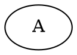
**Result:** 


Simple right? But it doesn't really "represent" anything. 

-----

Lets add another node `B`: 

**Code:**
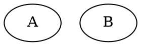
**Result:**


Wow. Still doesn't represent anything but a couple of letters. Chill .... 

-----

Let's add a relationship (edge) between `A` and `B`:

**Code:**
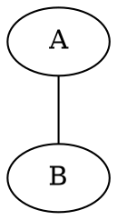
**Result:**


Ahhh! Finally a relationship between  `A` and `B`.

-----

We have a relationship from `A` to `B`, can I add another between `B` and `A`??

**Code:**
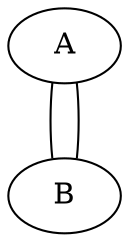
**Result:**


Yes I can, but this looks confusing?. It's not incorrect, and there are plenty of ways to make those edges unique (labels, weights, colors, dashed or dotted ... tons of ways!), but lets go for the simplest change: `graph` to `digraph`.

-----

Digraph shows **direction**. We replace `graph` with `digraph` and we change our edges from `--` to `->` to get the correct output:

**Code:**
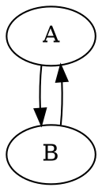
**Result:**


>**Note**: Be careful about mixing edge types. If you use the `digraph` keyword use `->` and likewise if you use the `graph` keyword us `--`. We can alter the behavior of each, but as a default behavior, `Graphviz` will complain if you try and mix and match.

-----

`Graphviz` is also pretty smart about positioning your data structures (graphs) so that they look "organized" and well thought out. This is NOT a trivial task! As a basic example, check out this "mini" binary tree: 

**Code:**
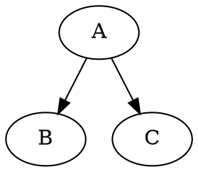
**Result:**


This last example shows that every unique "string" on the left OR right of an edge (`--` or `->`) will create a **new node**. We have `A` going to `B` as well as `A` going to `C`. `Graphviz` knows that since you used `A` previously (`A->B`), that when you used it again it assumed that `A` needed another edge leaving it going to `C`. This may be obvious to some, but I'm just trying to make sure we don't overlook the basics. So sorry if I'm "over-explaining".

>Note: I also think its annoying that we have to be consistent with `--` or `->` depending on the graph, BUT I did not write the software so ..... there are proably a few design reasons making this a necessity. So I will shutup. 
 
-----

#### Linked List Example 

The above examples in the first section showed us the "bare bones" basics of how to add "nodes" and also add "edges" between nodes. What if I wanted to print out a linked list of numbers? Here is my linked list: `Head->3->5->2->11->21->NULL`. This will be easy: 

**Code:**
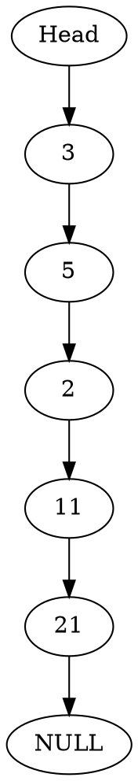
**Result:**


1. We should notice that every unique string before or after an "edge" gets turned into a unique node (this is important to remember) and appropriate edges connect them in a logical fashion without us worrying about order.
2. But seriously, whats with the up and down linked list? That's just weird. 

-----

Lets fix it:

**Code:**
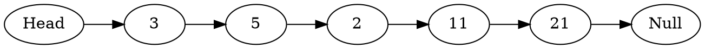
**Result:**


-----

### Styling Nodes and Edges

I hope you're thinking that ok ... this isn't photo shop, but we still have a lot of possible potential with this library. Anything created programmatically gives us at least the following possibilities:

1. Speed of creation (microseconds)
2. Magnitude of creation (thousands to hundreds of thousands of items in the output)

Having said that, we aren't writing a c++ wrapper to handle all the capabilities of GraphViz. We are sticking with a very much reduced implementation that will define nodes, edges, and then style each as we see fit.

So, let's redraw the linked list using different styles for the head and null pointer nodes:

**Code:**

**Result:**


>Note:
> - nodes can be defined and styled at top of graph body
> - edges can connect already style nodes further down in the graph body
    
We can also add a generic definition that accounts for all nodes, like the "shape". This will apply to every "node", unless we override that definition for individual nodes:


**Code:**

**Result:**

Each node is now shaped like a "record", except the nodes labeled with "Head" and "Null". They were styled individually, and overrode the "default" style. 


-----

This code is nearly identical to the above snippet. There IS an issue! What is it?

**Code:**
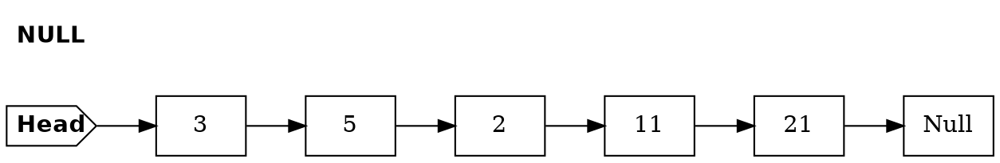
**Result:**


The problem is `NULL != Null`. Graphviz see's those as two different identifiers, just as a programming language would. The `NULL` id got the unique styling (but was never used), so the `Null` id received the default styling for all `nodes`. 

-----

### Advanced Styling (lol Not Really)


-----

For example, here is an array: 


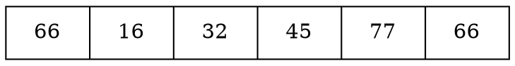

Which results in: 


#### Binary Tree Example
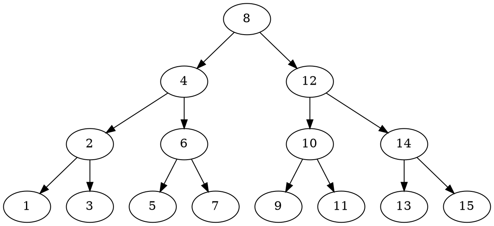