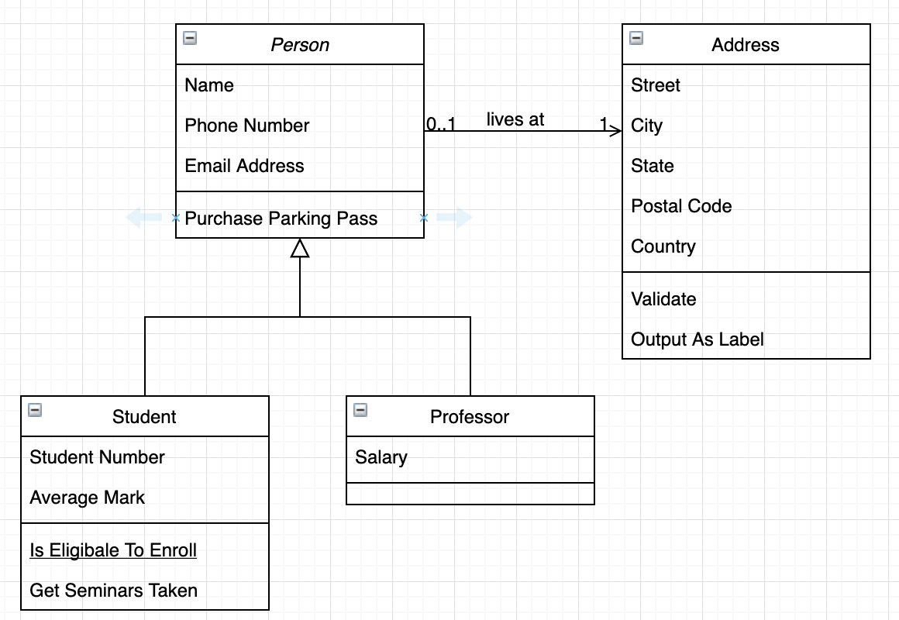

## Assignment 5 - Designing your Game

#### Due: 05-04-2023 (Thursday @ 2:00 p.m.)

UML is a general-purpose, modeling language designed to provide a standard way to visualize the design of a system. In the context of OOP, UML can be particularly helpful for several reasons:

**Abstraction**: UML allows developers to create high-level, abstract models of their object-oriented systems. By visually representing classes, objects, relationships, and interactions, UML can help developers better understand and communicate the structure and behavior of their systems.

**Encapsulation**: One of the core principles of OOP is encapsulation, which refers to the practice of bundling data and methods within a single unit (a class). UML class diagrams can represent the structure of classes, including their attributes and methods, as well as the relationships between classes, such as inheritance, association, and aggregation.

**Inheritance**: Inheritance is another fundamental principle of OOP, allowing classes to inherit attributes and methods from parent classes. UML class diagrams can clearly depict inheritance relationships, making it easier for developers to understand the hierarchy and organization of their classes.

**Polymorphism**: Polymorphism is the ability of objects to take on different forms based on their class inheritance. UML can represent polymorphism through the use of interfaces and abstract classes, making it easier for developers to design and implement flexible systems.

**Collaboration and Communication**: UML provides various diagrams that can help illustrate how objects within an OOP system interact and communicate with one another. Sequence diagrams, for example, can show the order in which objects send and receive messages, while collaboration diagrams illustrate the relationships between objects.

Overall, UML can be a valuable tool for OOP developers, as it helps to visualize, understand, and communicate the structure and behavior of object-oriented systems. However, it's important to remember that UML is just a tool, and its effectiveness depends on how well developers use it to create clear, accurate, and maintainable models.

### Overview

When designing classes with the OOP mindset, you should follow a few principles to keep yourself out of trouble. I will list a few to help you when designing your D&D game (for example).

#### Dry (Don't Repeat Yourself)

- Don't write duplicate code.
- A class should do its own thing. If two classes are doing the same thing, to the same data, maybe it should be its own class entirely.
- Similarly, if you have a block of code in more than two places consider making it a separate method.

#### Single Responsibility Principle (SRP)

- A class should be written to handle **one** defined thing, and handle it well.
- The definition of "one" is the question here.
- Think along the lines of `decoupling`. For example when **ClassA** depends heavily on **ClassB**, the chances of **ClassA** being affected when **ClassB** is changed are high. We don't want this to happen.

#### Favor Composition over Inheritance

- To favor composition over inheritance is a design principle that gives the design higher flexibility.
- It is more natural to build classes out of various separate components rather than trying to find commonality between them in order to create an inheritance hierarchy.
- Having said this, the example for this assignment does have a seamless inheritance hierarchy, but not as clearly as we thought based on our last discussion. So I asked chatGPT how it would group the following classes:

|           |          |         |        |
| :-------: | :------: | :-----: | :----: |
| Barbarian | Fighter  |  Bard   | Cleric |
|   Druid   |   Monk   | Paladin | Ranger |
|   Rogue   | Sorcerer | Warlock | Wizard |

It's answer:

---

**Combat Roles:** One way to group these characters is based on their primary combat role. In this case, we can group them into four categories: melee combatants, ranged combatants, spellcasters, and support characters. The melee combatants include Barbarian, Fighter, Monk, Paladin, and Rogue. The ranged combatants include Ranger, Rogue, and some subclasses of Fighter and Paladin. The spellcasters include Bard, Cleric, Druid, Sorcerer, Warlock, and Wizard. The support characters include Bard, Cleric, Druid, Paladin, and some subclasses of Fighter and Ranger.

**Magic Types:** Another way to group these characters is based on the type of magic they use. In this case, we can group them into three categories: divine magic users, arcane magic users, and nature magic users. The divine magic users include Cleric and Paladin. The arcane magic users include Bard, Sorcerer, Warlock, and Wizard. The nature magic users include Druid and some subclasses of Ranger.

**Alignment:** A third way to group these characters is based on their moral alignment. In this case, we can group them into three categories: good, neutral, and evil. The good characters include Paladin and some subclasses of Cleric, Druid, and Ranger. The neutral characters include some subclasses of Bard, Cleric, Druid, Ranger, and Rogue. The evil characters include some subclasses of Warlock, Wizard, and Rogue.

**Theme or Background:** A fourth way to group these characters is based on their thematic or background similarities. In this case, we can group them into several categories: nature-themed characters (Druid and some subclasses of Ranger), divine-themed characters (Cleric and Paladin), arcane-themed characters (Sorcerer, Warlock, and Wizard), martial-themed characters (Barbarian, Fighter, Monk, and some subclasses of Ranger and Paladin), and versatile characters (Bard and some subclasses of Cleric, Fighter, Ranger, and Rogue).

---

I think these could help create classes that used inheritance, especially the first or second options.

## Starting UML

The previous section is to help your thoughts when dealing with character classes, however when you begin creating a UML design for a game similar to D&D you should start by identifying the `main components` of your system and their relationships. This means think much bigger and beyond characters. Here is a step-by-step process to help you get started.

### 1. Main Classes

- Some classes you may consider include:
  - Character
  - Player
  - GameMaster (or DungeonMaster)
  - Campaign
  - Weapon
  - Spell
  - Encounter (like a fight)
  - Monster
  - Item (anything that isn't a spell or a weapon)

### 2. Attributes and Methods

For each class, start to list its attributes and methods. For example, the **Character** class might have the following attributes and methods:

- Attributes:
  - name (string)
  - characterClass (string)
  - level (integer)
  - strength (integer)
  - dexterity (integer)
  - constitution (integer)
  - intelligence (integer)
  - wisdom (integer)
  - charisma (integer)
  - hitPoints (integer)
- Methods:
  - attack(target: Character)
  - defend(target: Character)
  - useItem(item: Item)
  - levelUp()

Remember!! This is a generic character class. There is nothing in the previous definition that tailors a character to a specific type.

### 3. Identify relationships

Determine the relationships between the classes. Some possible relationships include:

- Character has a Weapon
- Character has a Spell
- Player has a Character
- GameMaster manages a Campaign
- Campaign has multiple Encounters
- Encounter has multiple Characters (players and monsters)
- Character has multiple Items

## Create UML diagrams

Begin creating UML diagrams to visualize the structure and behavior of your system. Some diagrams you may consider include:

#### Class Diagram

Show the classes, their attributes and methods, and the relationships between them. **(This is the main one I am worried about for this assignment)**

#### Sequence Diagram

Illustrate how different objects in your system interact with each other during a specific scenario, such as combat or leveling up.

#### Use Case Diagram

Depict the high-level interactions between users (players, game masters) and the system.

### Iterate and refine

As you create your UML diagrams, you may uncover new insights or identify areas that need improvement. Iterate on your designs and refine them as needed.

Once you have a solid UML design, you can use it as a blueprint to guide your development process. Remember that your UML diagrams should evolve as your game design progresses, and make sure to keep them updated to reflect any changes you make along the way.

## Requirements / Attributes

When writing "requirements" for your classes (and we are following a very **loose** design process for now) you should think in the following terms:

- The **_\<thing\>_** should provide **_\<something\>_** so we can do **_\<this\>_**.
- They don't ALL have to fit this exactly, but each "requirement" or "attribute" should at least have a **_\<subject\>_** => **_\<verb\>_** approach.

**Example:**

- A **character** (the \<**thing**\>) should know its **name** (the <**something**\>) so it can be **displayed** (the \<**this**\>) on a game window.
- A player (the \<**thing**\>) should know its **character type** (the <**something**\>) so it can be **checked** (the \<**this**\>) for strengths and weaknesses.
- A character (the \<**thing**\>) should know its **weapon(s)** (the <**something(s)**\>) so it can **choose** (the \<**this**\> (_a weapon_)) for an appropriate battle opponent.
- Without all the keywords embedded now:
  - A character should know its strengths so it can attack some opponent.
  - A player should know its party members so it can make decisions (attack, run, hide,etc) accordingly.

### Possible Classes

#### Character

- Has a Class
- Has a Level
- Has a Constitution
- Has Hitpoints
- Has a Location (could change)
- Can attack other characters

#### Monster

- Has a Class
- Has a Level
- Has a Constitution
- Has Hitpoints
- Has a Location (could change)
- Can attack Characters

Hmmmm.... A Character and Monster seem a lot alike! What can we do about that?!?

#### GamePlay

- When a `Player` (character) runs into a `Monster` a repetitive algorithm is applied (attack, defend, repeat).
- When a `Character` wins (loses) a battle their HitPoints (and other stats) are affected (positively or negatively).
- A `GameMaster` must apply current situation to all `Characters` using pre-determined probabilities and random number generation.

#### Text

- Has a Font (can change)
- Has a Location
- Has a Color
- Has a Size

#### Game

- Has player(s)
- Has score(s)
- Has debris(s) (yes "debris" can be plural but it doesn't make the point)

### UML Unified Modeling Language

At the start of this document, we discuss some heuristics for designing your classes (dry method, single responsibility, etc.) but how do we turn that into an actual class design?
One way is to use UML to visually model your classes using UML. This is where we are gonna start for our first program. I have an overview of [UML](../../Resources/04-UML/README.md) in the resources folder. However, there is a video from a site called Lucidcharts that explains it in a very understandable and concise way. Better than I could do :)

<a href="https://www.youtube.com/embed/UI6lqHOVHic"></a>

You can use LucidChart to do your diagrams, or you can use [Diagrams.net](https://app.diagrams.net/) to make your diagrams. LucidChart is free to some extent, but it makes you create an account where [Diagrams.net](https://app.diagrams.net/) does not (I think you need a gmail address, which most of you have).


### Example Document

You would replace the example labels with your game labels:

```
### Person


### Street


### Student


### Professor


### Diagram


```

Would result in:

### Person


### Street


### Student


### Professor


### Diagram



### Deliverables

**This assignment has a LOT of verbiage up above talking about many things beyond what I'm expecting from you. I simply want you to create a class diagram with the relationships between all the classes. No requirements, use cases, sequences, etc..**

- Create a folder called `A05` in your `Assignments` folder.
- Add a `README.md` file in your `A05` folder with all of your class designs listed in an orderly fashion.
- Your document should be written in markdown.
- Don't forget to include your Name and essentials at the top of the document.
- No hand written anything will be graded.
- Bring a print out of your readme to class on the due date.
- There is an extension called `Markdown PDF` that will convert markdown files to PDF's to assist in printing.
- There are also extensions to print from Vscode. Just search for "Print" in extensions.
- Don't forget your banner (cover page).

```
A05
2143
LASTNAME
```

- If your banner is wrong - you lose a letter grade. Its VERY confusing if you don't include the correct banner.
