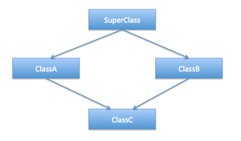

## Test 3 Study Guide
#### Due: 11-30-2022 (Wednesday @ 11:00 a.m.)

1. First exam was more code and short answer. Scores were not great.
2. Second exam was more objective questions (MC), but right from the study guide. Scores were good.
3. Third exam will be more short answer and fixing code. So, warning, make your short answer thorough. Always give examples when you can. Always comment code snippets to help the grader.

## Question Topics

* The word `static` can mean different things when we discuss OOP. When is it used as an actual `keyword`? And what is it used for?
* What is a static method? Why is it used. Where does it live?
* How can you access a static method OR a static data member? Be able to write examples!

-----

* What is the triangle problem? This was briefly mentioned weeks ago, but research the "diamond problem" and be able to explain this multi-inheritance problem!
  

-----

* Define the following and give **examples** of each (it never ends with these three :smile:):
    * Polymorphism
    * Encapsulation
    * Abstraction
    * Remember: [^1] 

-----

- Constructors for objects. 
    * What is a constructor?
    * Always necessary?
    * Define copy constructor.
    * Overloading Assignment same as copy constructor?
    * When does Deep copy come into play?
    * Remember: [^1] 

-----

* What is the difference between an abstract class and an inter-
* face?. 
* Use examples, key words, etc [^1]. 

-----

* Define public, protected, and private. When should you use each? Examples with code [^1]!

-----

* Discuss Early and Late binding.
* You should have these keywords present when answering this question: `static`, `dynamic`, `virtual`, `abstract`, `interface`. 
* I can’t say it enough, use examples in your discussion, code, or analogies [^1].

-----

* What is a design pattern? Describe the following patterns and give examples of when to use:
    * Facade
    * Singleton
    * Factory
    * Observer
* I used the term "design pattern" when we talked about "static" data members. Remember the "borg" pattern? We by no means talked in depth about them, or are they in the course notes. But, they are important. Look up the above design patterns (google) and answer the question [^1].

-----

* Write a class that **forces** sub class(s) to overload specific methods [^1].

-----

* Understand dynamic vs static polymorphism. Be able to write a code example that used both [^1].

-----

* I will give you code that has instances of `abstract classes`, `overridden methods`, `overloaded methods`, etc. and you should be able to determine outputs or if they will run[^1].

----- 

* Given multiple classes that are similar, or related, they do not inherit from each other, but they basically have somewhat duplicated code. Be able to rewrite the set of classes using an inheritance scheme [^1]. 

-----

* Given a set of classes, with minimal data, re-write the classes using appropriate choices for inheritance or composition [^1].

[^1]: Examples, Examples, Examples!!
