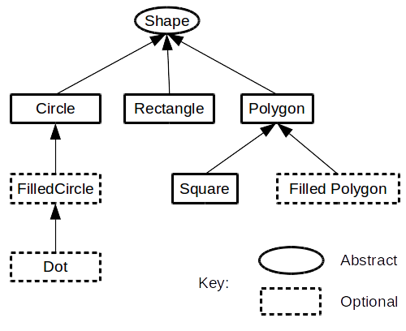
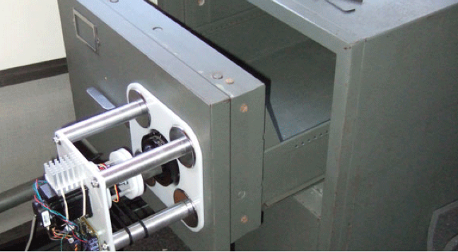

## Goodbye, Object Oriented Programming

Original Article: https://cscalfani.medium.com/goodbye-object-oriented-programming-a59cda4c0e53


Charles Scalfani

Jul 23, 2016


I’ve been programming in Object Oriented languages for decades. The first OO language I used was C++
and then Smalltalk and finally .NET and Java.

I was gung-ho to leverage the benefits of ***Inheritance***, ***Encapsulation***, and
***Polymorphism***. The Three Pillars of the Paradigm.

I was eager to gain the promise of Reuse and leverage the wisdom gained by those who came before me
in this new and exciting landscape.

I couldn’t contain my excitement at the thought of mapping my real-world objects into their Classes
and expected the whole world to fall neatly into place.

**I couldn’t have been more wrong.**

## Inheritance, the First Pillar to Fall


At first glance, Inheritance appears to be the biggest benefit of the Object Oriented Paradigm. All
the simplistic examples of shape hierarchies that are paraded out as examples to the newly
indoctrinated seem to make logical sense.



And Reuse is the word of the day. No… make that the year and perhaps evermore.

I swallowed this whole and rushed out into the world with my newfound insight.

### Banana Monkey Jungle Problem

With religion in my heart and problems to solve, I started building Class Hierarchies and writing
code. And all was right with the world.

I’ll never forget that day when I was ready to cash in on the promise of Reuse by inheriting from an
existing class. This was the moment I had been waiting for.

A new project came along and I thought back to that Class that I was so fond of in my last project.

No problem. Reuse to the rescue. All I gotta do is simply grab that Class from the other project and
use it.

Well… actually… not just that Class. We’re gonna need the parent Class. But… But that’s it.

Ugh… Wait… Looks like we gonna also need the parent’s parent too... And then… We’re going to need
ALL of the parents. Okay… Okay… I handle this. No problem.

And great. Now it won’t compile. Why?? Oh, I see… ***This*** object contains ***this other***
object. So I’m gonna need that too. No problem.

Wait… I don’t just need ***that*** object. I need the object’s parent and its parent’s parent and so
on and so on with every contained object and ALL the parents of what those contain along with their
parent’s, parent’s, parent’s…

Ugh.

There’s a great quote by ***Joe Armstrong***, the creator of Erlang:

> The problem with object-oriented languages is they’ve got all this implicit environment that they
> carry around with them. You wanted a banana but what you got was a gorilla holding the banana and
> the entire jungle.

### Banana Monkey Jungle Solution

I can tame this problem by not creating hierarchies that are too deep. But if Inheritance is the key
to Reuse, then any limits I place on that mechanism will surely limit the benefits of Reuse. Right?

Right.

So what’s a poor Object Oriented Programmer, who’s had a healthy helping of the Kool-aid, to do?

Contain and Delegate. More on this later.

### The Diamond Problem

Sooner or later, the following problem will rear its ugly and, depending on the language, unsolvable
head.


Most OO languages do not support this, even though this ***seems*** to make logical sense. What’s so
difficult about supporting this in OO languages?

Well, imagine the following pseudocode:

```js
    class PoweredDevice {}
    class Scanner inherits from PoweredDevice {
        function start() {}
    }
    class Printer inherits from PoweredDevice {
        function start() {}
    }
    class Copier inherits from Scanner, Printer {}
```

Notice that both the *Scanner* class and the *Printer* class implement a function called *start*.

So which start function does the *Copier* class inherit? The *Scanner* one? The *Printer* one? It
can’t be both.

### The Diamond Solution

The solution is simple. Don’t do that.

Yes that’s right. Most OO languages don’t let you do this.

But, but… what if I have to model this? I want my Reuse!

Then you must **Contain and Delegate**.

```js
    class PoweredDevice {}
    class Scanner inherits from PoweredDevice {
        function start() {}
    }
    class Printer inherits from PoweredDevice {
        function start() {}
    }
    class Copier {
        Scanner scanner
        Printer printer
        function start() {
            printer.start()
        }
    }
```

Notice here that the *Copier* class now contains an instance of a *Printer* and of a *Scanner*. It
delegates the *start* function to the *Printer* class’s implementation. It could just as easily
delegated to the *Scanner*.

This problem is yet another crack in the Inheritance pillar.

### The Fragile Base Class Problem

So I’m making my hierarchies shallow and keeping them from being cyclical. No diamonds for me.

And all was right with the world. That is until…

One day, my code works and the next day it stops working. Here’s the kicker. **I didn’t change my
code**.

Well, maybe it’s a bug… But wait… **Something did change**…

**But it wasn’t in my code**. Turns out the change was in the class that I inherited from.

How could a change in the Base class break my code??

This is how…

Imagine the following Base class (It’s written in Java, but it should be easy to understand if you
don’t know Java):

```java
    import java.util.ArrayList;
        
    public class Array{
        
        private ArrayList<Object> a = new ArrayList<Object>();
        
        public void add(Object element){
            a.add(element);
        }
        
        public void addAll(Object elements[]){
            for (int i = 0; i < elements.length; ++i){
                a.add(elements[i]); // this line is going to be changed
            }
        }
    }
```

**IMPORTANT**: Notice the commented line of code. This line is going to be changed later which will
break things.

This class has 2 functions on its interface, ***add()*** and ***addAll()***. The ***add()***
function will add a single element and ***addAll()*** will add multiple elements **by calling the
add function**.

And here’s the Derived class:

```java
    public class ArrayCount extends Array{
        private int count = 0;
        
        @Override
        public void add(Object element){
            super.add(element);
            ++count;
        }
        
        @Override
        public void addAll(Object elements[]){
            super.addAll(elements);
            count += elements.length;
        }
    }
```

The ***ArrayCount*** class is a specialization of the general ***Array*** class. The **only**
behavioral difference is that the ***ArrayCount*** keeps a ***count*** of the number of elements.

Let’s look at both of these classes in detail.

The ***Array*** ***add()*** adds an element to a local ***ArrayList***.  
The ***Array*** ***addAll()*** calls the local **ArrayList** add for each element.

The ***ArrayCount*** ***add()*** calls its parent’s ***add()*** and then increments the
***count***.  
The **ArrayCount** ***addAll()*** calls its parent’s ***addAll()*** and then increments the
***count*** by the number of elements.

And all works fine.

Now for the **breaking change**. The commented line of code in the Base class is changed to the
following:

```java
    public void addAll(Object elements[]){
        for (int i = 0; i < elements.length; ++i)
            add(elements[i]); // this line was changed
    }
```

As far as the owner of the Base class is concerned, it still functions as advertised. **And all of
the automated tests still pass**.

But the owner is oblivious to the Derived class. And the owner of Derived class is in for a rude
awakening.

Now ***ArrayCount addAll()*** calls its parent’s ***addAll()*** which **internally** calls the
***add()*** which has been **OVERRIDEN** by the **Derived** class.

This causes the ***count*** to be incremented each time the **Derived** class’s ***add()*** is
called and then it’s **incremented** **AGAIN** by the number of elements that were added in the
**Derived** class’s ***addAll()***.

**IT’S COUNTED TWICE.**

If this can happen, and it does, the author of the Derived class must KNOW how the Base class has
been implemented. And they must be informed about every change in the Base class since it could
break their Derived class in unpredictable ways.

Ugh! This huge crack is forever threatening the stability of precious Inheritance pillar.

### The Fragile Base Class Solution

Once again Contain and Delegate to the rescue.

By using Contain and Delegate, we go from White Box programming to Black Box programming. With White
Box programming, we have to look at the implementation of the base class.

With Black Box programming, we can be completely ignorant of the implementation since we cannot
inject code into the Base class by overriding one of its functions. We only have to concern
ourselves with the Interface.

This trend is disturbing…

Inheritance was supposed to be a huge win for Reuse.

Object Oriented languages don’t make Contain and Delegate easy to do. They were designed to make
Inheritance easy.

If you’re like me, you’re starting to wonder about this Inheritance thing. But more important, this
should shake your confidence in the power of Classification via Hierarchies.

### The Hierarchy Problem

Every time I start at a new company, I struggle with the problem when I’m creating a place to put my
Company Documents, e.g. the Employee Handbook.

Do I create a folder called Documents and then create a folder called Company in that?

Or do I create a folder called Company and then create a folder called Documents in that?

Both work. But which is right? Which is best?

The idea of Categorical Hierarchies was that there were Base Classes (parents) that were more
general and that Derived Classes (children) were more specialized versions of those classes. And
even more specialized as we make our way down the inheritance chain. (See the Shape Hierarchy above)

But if a parent and child could arbitrarily switch places, then clearly something is wrong with this
model.

### The Hierarchy Solution

What’s wrong is…

**Categorical Hierarchies don’t work**.

So what are hierarchies good for?

**Containment**.

If you look at the real world, you’ll see Containment (or Exclusive Ownership) Hierarchies
everywhere.

What you won’t find is Categorical Hierarchies. Let that sink in for a moment. The Object Oriented
Paradigm was predicated upon the real world, one filled with Objects. But then it uses a broken
model, viz. Categorical Hierarchies, where there is no real-world analogy.

But the real world is filled with Containment Hierarchies. A great example of a Containment
Hierarchy is your socks. They are in a sock drawer which is contained in one drawer in your dresser
which is contained in your bedroom which is contained in your house, etc.

Directories on your hard drive are another example of a Containment Hierarchy. They contains files.

So how do we categorize then?

Well, if you think of the Company Documents, it pretty much doesn’t matter where I put them. I can
put them in a folder of Documents or a folder called Stuff.

The way I categorize it is with tags. I tag the file with the following tags:

    Document
    Company
    Handbook

Tags have no order or hierarchy. (This solves the Diamond Problem too.)

Tags are analogous to interfaces since you can have multiple types associated with the document.

But with so many cracks, it looks like the Inheritance pillar has fallen.

**Goodbye, Inheritance.**

## Encapsulation, the Second Pillar to Fall



At first glance, Encapsulation appears to be second biggest benefit of Object Oriented Programming.

Object state variables are protected from outside access, i.e. they’re Encapsulated in the Object.

No longer will we have to worry about global variables that are being accessed by who-knows-who.

Encapsulation is a Safe for your variables.

This Encapsulation thing is INCREDIBLE!!

Long live Encapsulation…

That is until…

### The Reference Problem

For efficiency sake, Objects are passed to functions NOT by their value but by reference.

What that means is that functions will not pass the Object, but instead pass a ***reference*** or
pointer to the Object.

If an Object is passed by reference to an Object Constructor, the constructor can put that Object
reference in a private variable which is protected by Encapsulation.

But the passed **Object is NOT safe!**

Why not? Because some other piece of code has a pointer to the Object, viz. the code that called the
Constructor. It MUST have a reference to the Object otherwise it couldn’t pass it to the
Constructor?

### The Reference Solution

The Constructor will have to Clone the passed in Object. And not a shallow clone but a deep clone,
i.e. every object that is contained in the passed in Object and every object in those objects and so
on and so on.

So much for efficiency.

And here’s the kicker. Not all objects can be Cloned. Some have Operating System resources
associated with them making cloning useless at best or at worst impossible.

And **EVERY** single mainstream **OO language** has this problem.

**Goodbye, Encapsulation.**

## Polymorphism, the Third Pillar to Fall


Polymorphism was the redheaded stepchild of the Object Oriented Trinity.

It’s sort of the Larry Fine of the group.

Everywhere they went he was there, but he was just a supporting character.

It’s not that Polymorphism isn’t great, it’s just that you don’t need an Object Oriented language to
get this.

Interfaces will give you this. And without all of the baggage of OO.

And with Interfaces, there isn’t a limit to how many different behaviors you can mix in.

So without much ado, we say goodbye to **OO** Polymorphism and hello to **interface-based**
Polymorphism.

### Broken Promises


Well, OO sure promised a lot in the early days. And these promises are still being made to naive
programmers sitting in classrooms, reading blogs and taking online courses.

It’s taken me years to realize how OO lied to me. I too was wide-eyed and inexperienced and
trusting.

And I got burned.

**Good-bye, Object Oriented Programming.**

## So then what?

Hello, **Functional Programming**. It’s been so nice to work with you over the past few years.

Just so you know, I’m NOT taking any of your promises at face value. I’m going to have to see it to
believe it.

**Once burned, twice shy and all.**

You understand.


