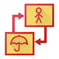
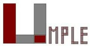
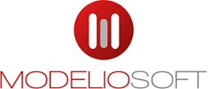

# BEST 28 UML Tools in 2020

  - Details  
     Last Updated:
    14 February 2020

UML stands for Unified Modeling Language. It is a standard which is
mainly used for creating object-oriented, meaningful documentation
models for any software system present in the real world. It offers rich
models that describe the working of any software/hardware systems.

There are many tools available in the market for designing UML diagrams.
Following is a curated list of Top 28 handpicked UML tools with popular
features and latest download links. This comparison list contains open
source as well as commercial tools.

### 1\) StarUML

****

StarUML is an open source software modeling tool. It provides eleven
types of diagram. StartUML 2 is compatible with UML 2.x versions.

**Features:**

  - Allows you to create Obje3ct, Use case, Deployment, Seque3nce,
    Communication, Activity, and profile Diagram.
  - Allows you to discover and install third-party extensions.
  - Work with same UX in multiple platforms including macOS, Windows,
    and Linux.
  - No limit for using this commercial software for evaluation.

**Download link:** <http://staruml.io/>

### 2\) Umbrello:

****

Umbrello is a UML modeling tool. It runs under KDE and Linux. The tool
also supports code generation as well as reverse engineering for C++ and
Java.

**Features:**

  - It allows you to create diagrams of software and another system in a
    standard format
  - It helps you to check the screenshot to see umbrello in action.
  - Offers handbook to give instruction to Umbrello and UML modeling.

**Download link:** [htps://umbrello.kde.org/](https://umbrello.kde.org/)

### 3\) UML designer tool:

UML Designer tool offers a set of common diagrams to work with UML 2.5
models. The tool provides an easy method for the transition from UML to
domain-specific modeling.

**Features:**

  - Allows user to re-use provided representations and work in total
    transparency on both DSL and UML models
  - Helps you to create a Class diagram, Component Diagram, and
    composite structure Diagram
  - Allows you to use legacy UML models and start working with DSL.

**Download link:** <http://www.umldesigner.org/>

### 4\) Altova

Altova UModel is another useful UML tool which makes visual software
design practical for any project. Visually design application models in
UML which can be generated using Java, C++, C\#, or Visual Basic.

**Features:**

  - Intuitive Visual Modeling for all UML Diagrams
  - Helper windows allow you to build your desired models.
  - It allows you to add hyperlinks to any element in any UML diagram.
  - You can assign an element to the specific layer, and layers can be
    locked to prevent changes.

**Download link:** <https://www.altova.com/umodel>

### 5\) Umple

****

Umple is an open source model for integrating textual UML constructs in
programming languages, code generation or using simple UML modeling
method.

**Features:**

  - It allows developers to embed modeling concepts patterns, generation
    templates, and other abstractions in traditional code.
  - Umple tool helps users to learn UML faster.
  - The tool can works online, as Eclipse plugin, and also stand-alone
    command-line Jar.

**Download link:** <https://cruise.eecs.uottawa.ca/umple/>

### 6\) Visual Paradigm

****

Visual Paradigm is a software design tool which is tailored for engine
software projects. This UML tool helps the software development team to
a model business information system and development processes.

**Features:**

  - It offers support for BPMN, UML, ERD, DFD, SysML.
  - It offers a complete tool like for process analysis, system design,
    database design, etc.
  - Offers user story feature to capture and maintain user's needs.

**Download link:** <https://www.visual-paradigm.com/>

### 7\) WhitestarUML

****

WhiteStarUML is another important Universal modeling tool which offers
all the feature which can be adapted to the modern environment like the
support of Unicode strings.

**Features:**

  - Windows 7, 8, 10 versions supported.
  - It provides the best functionality expected from a UML tool like a
    large selection of supported diagrams.
  - Good usability giving the overall look and feel of a serious
    programming environment.

**Download link:** <http://whitestaruml.sourceforge.net/>

### 8\) Draw.IO

Draw.IO is a free online UML tool. It allows users to create and manage
the drawing easily these tools. A lot of the wide and early share
available with this tool.

**Features:**

  - No limit on the number of sizes
  - Templates are present in software design itself.
  - Allows you to save the model in your preferred location

**Download link**: <https://www.draw.io/>

### 9\) GenMyModel

****

GenMyModel began as a UML tool but, today It is expanded to cover also
business modeling with Archimate and BPMN support. It offers a
centralized model repository which allows easy and simultaneously models
collaboration.

**Features:**

  - Share your knowledge with versioning and access right management.
  - Useful for presentations to management and project stakeholders.
  - Helps you to combines the power of desktop modeling tools with a
    modern web solution.
  - Allows you to directly import or export as PDF documents.

**Download link:** <https://www.genmymodel.com/>

### 10\) UMLetino:

****

It is accessible to the user as an open source UML tool for developing
UML diagrams. It can directly run in your browser, and it does not need
any installations.

**Features:**

  - Diagrams can be exported as XML or any other image files.
  - Allows you to store diagrams with other teammates
  - Offers you to export diagrams in SVG, Gif or JPEG format.

**Download link:** <http://www.umlet.com/umletino/umletino.html>

### 11\) Diagramo:

Diagramo is a free and open source HTML5 online flowchart software. It
is easy to download and install on your server.

**Features:**

  - It allows you to save diagrams as images
  - It is flow chart focused software which only one kind of UML
    diagrams.

**Download link:** <http://diagramo.com/>

### 12\) Astah:

****

Astah is a UML editor which is integrated with Mind mapping features.
The tool helps you to visualize the essence of your ideas before you
code.

**Features:**

  - Faster to create UML compares with Excel or non-UML-specific drawing
    tools.
  - Visualize requirements and functional requirements, all the
    relations between them and to other model elements.
  - Merge, exclusive control, copy & paste support.

**Download link:** <http://astah.net/>

### 13\) Visual Modeling Software

****

Microsoft focus is a visual modeling tool which allows business and
software development to analyze and design software architecture.

**Features:**

  - This platform offers you to model enterprise architectures in such a
    way that requirements, architectures, and code are always in sync
  - Offers Model-driven Architecture and data modeling systems
  - Livesource technology feature allows you to use programming language
    source code to management elements and eliminate unnecessary work

**Download link:**
<https://www.microfocus.com/en-us/products/together/overview>

### 14\) BOUML:

****

BOUML is a free UML2 tool which includes modeler. This helps you to
specify and generate code in C++, Java, Php, Python, and MySQL.

**Features:**

  - It runs under Windows, Linux and MacOS X versions.
  - it helps you to program simultaneously in C++, Java, Php, Python,
    MySQL, etc.
  - it is very fast and not need much memory to manage several thousands
    of classes, see benchmark

Download link: <https://www.bouml.fr/>

### 15\) ConceptDraw

****

ConceptDraw DIAGRAM offers a complete range of business graphic
documentation solutions. These UML solutions offer business-specific
add-ons which offer an extensive variety of workflow requirements.

**Features:**

  - ConceptDraw DIAGRAM v12 offers powerful and comprehensive drawing
    tools.
  - Helps you to empower your communication processes and improve your
    presentation techniques.
  - The tool is an ideal suite for building plan software.
  - You can use very important business metrics and track with live
    object technology.

**Download link:** <https://www.conceptdraw.com/products/drawing-tool>

### 16\) Dia:

****

Dia is a full-featured diagramming program which is licensed under GPL.
It allows you to draw various types of diagrams and has special objects
to help you to draw ER diagrams, UML diagrams, flowcharts, network
diagrams, and many other diagrams.

  - It offers support for new shapes by writing simple XML files, using
    a subset of SVG to draw the shape.
  - It allows you to export diagrams to a number of formats, including
    EPS, SVG, XFIG, WMF, and PNG.

**Download link:** <http://dia-installer.de/>

### 17\) Sparxsystems

****

Sparx system is a diagram design tool for modeling documenting, building
and maintaining object-oriented features. It is one of the leading
vendors of innovative solution based on the Unified Modeling Language.

**Features:**

  - Helps you for effective project management
  - High-performance model repository
  - Offers End-to-end traceability
  - Powerful document generation

**Download link:** <https://sparxsystems.com/>

### 18\) Giffy

****

Gliffy is a free online drawing tool which provides support for drawing
UML diagrams. It is one of the most widely used online diagramming
application.

**Features:**

  - Allows you to draw a diagram with ease
  - It offers the power of visual communication and collaboration.
  - Fast and effective integration with Jira and Confluence
  - Strong supports for BPMP process models

**Download link:** <https://www.gliffy.com/>

### 19\) Lucidchart

****

Lucidchart is HTML-5 based UML tool which also offers real-time
collaboration capabilities. It allows you to create a simple flowchart
to complex technical diagrams.

**Features:**

  - Works with your team on any device across various platforms
  - Allows you to connect live data with your diagrams or import data to
    automatically build organization charts
  - Helps you to increase security and easily manage user accounts
  - It is Integrated seamlessly with MS office, G suite, Atlassian, etc.

**Download link:** <https://www.lucidchart.com/pages/>

### 20\) Magic Draw:

****

A magic draw is the first comprehensive version for professional
modeling. Modern design and clear layout set this desktop app apart from
the rest a proprietary for high demands.

**Features:**

  - Constantly added new features based on the feedback given by the
    users
  - Floating licenses help you to save significantly if you have
    multiple developers that you need to use MagicDraw for a specific
    period of time.
  - Once purchased you can run the software in various applications.
  - Magic draw expert team offer 24 hours free support.
  - The learning is straightforward and the learning period is short.

**Download link:** <https://www.nomagic.com/products/magicdraw>

### 21\) Visio

****

Microsoft Visio is a popular chart and visualization software. It
belongs to office family so it can easily be integrated with other
Microsoft office products.

**Features:**

  - Visio helps you to create professional diagram by creating
    flowcharts, diagrams, org charts, engineering designs, and more.
  - Allows you to connect flowcharts and diagrams to real-time data.
  - It allows you to work together on diagrams from a web browser, from
    almost anywhere.

**Download link:**
<https://products.office.com/en-in/visio/flowchart-software>

### 22\) Modelio:

****

Modelio is the first modeling environment. The tool combines BPMN
support and UML support. It provides support for a wide range of models
and diagrams.

**Features:**

  - Modelio offers an XMI import/export feature that enables you to
    exchange UML2 models between various tools.
  - You can extend modelio for any language, methodology or modeling
    technique.
  - It offers integrated support of the Jython scripting language.

**Download link:** <https://www.modelio.org/>

### 23\) Nclass

NClass is a free tool which is used to create UML class diagrams with
full C\# and Java language support. It has a straightforward and
user-friendly interface for easy and fast development.

**Features:**

  - A diagram helps users to create professional looking diagrams
  - Offers simple yet powerful class designer who is intuitive to use
  - Allows you to build professional looking diagrams

**Download link:** <http://nclass.sourceforge.net/>

### 24\) Openmodelsphere:

****

Open ModelSphere is a useful data, process, and engineering modeling
tool. It is a platform-independent, tool which supports user interface
in English and French languages.

**Features:**

  - It provides users' interfaces in English and French languages.
  - Huge support from the community of software architects and
    engineers.
  - It helps systems analysts to integrate the creation of data flow and
    business process diagrams.
  - Expert modules to validate the integrity developed architecture.

**Download link:** <http://www.modelsphere.com/org/>

### 25\) Systems design rhapsody

****

The IBM Engineering Systems Design Rhapsody is a family of products
offers a wide range of solution for UML modeling and designing. It helps
you to manage the complexity many organizations face with product and
systems development.

**Feature:**

  - Offers continuous validation
  - Allows you to perform automatic consistency checking
  - Helps you to Collaborate with your engineer team
  - Analyze and elaborate requirements of your project
  - Automate design reviews and generate documentation

Download link:
<https://www.ibm.com/in-en/marketplace/systems-design-rhapsody>

### 26\) Reactive Blocks

****

Reactive Blocks is a UML tool which supports visual model-driven
development approach. It supports automated code generation,
hierarchical modeling, and an extensive library of ready-to-use
components.

**Features:**

  - Building applications from blocks leads to a cleaner architecture
    because everyone is following the same principles.
  - The formal stateful analysis helps to spot mistakes and errors early
    during development.
  - Reactive Blocks auto-generates standard Java source code. This
    allows the integration with any Java-based IoT stack.

Download link: <http://www.bitreactive.com/reactive-blocks/>

### 27\) Softwareideasmodeler

****

Software Ideas Modeler is a designing tool for drawing UML, SysML, ERD,
ArchiMate, flowcharts. It allows you to create user stories and offers
wireframe support.

**Features:**

  - Offers easy Diagramming and Layout.
  - Software Ideas Modeler tool offers you a lot of predefined styles,
    which makes your diagrams more attractive.
  - Documented software has better maintainability.

**Download link:** <https://www.softwareideas.net/>

 

  - [
    Prev](/deployment-diagram-uml-example.html "Deployment Diagram: UML Tutorial with EXAMPLE")
  - [Next
    ](/uml-tutorial-pdf.html "UML Tutorial for Beginners PDF")

