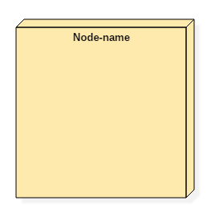

# Component Diagram: UML Tutorial with EXAMPLE

  - Details  
     Last Updated:
    06 February 2020

## What is Component Diagram?

When modeling large object-oriented systems, it is necessary to break
down the system into manageable subsystems. UML component diagrams are
used for modeling large systems into smaller subsystems which can be
easily managed.

A component is a replaceable and executable piece of a system whose
implementation details are hidden. A component provides the set of
interfaces that a component realizes or implements. Components also
require interfaces to carry out a function.

UML Component diagrams are used to represent different components of a
system.

In this UML tutorial, you will learn:

  - [What is Component Diagram?](#1)
  - [Component diagram Notations](#2)
  - [What is a component?](#3)
  - [Why use Component Diagram?](#4)
  - [When to use Component Diagram?](#5)
  - [How to draw a component diagram](#6)
  - [Example of a component diagram](#7)

## Component diagram Notations

1.  A component

2.  A node

## What is a Component?

A component is a replaceable and executable piece of a system whose
implementation details are hidden. A component provides the set of
interfaces that a component realizes or implements. Components also
require interfaces to carry out a function.

It is a modular part of a system that encapsulates its contents. They
are the logical elements of a system that plays an essential role during
the execution of a system.

A component is similar to a black box whose external behavior is defined
by a provided interface and required interfaces.

### Structure of a component

A component is represented with classifier rectangle stereotypes as

\<\< component \>\>. Component details are hidden for the outside world.
The name of a component is placed at the center of a rectangle. A
component icon is displayed at the upper right corner of a rectangle,
which is optional.

A component in UML is represented as follows,

### Interfaces

The interface is a named set of public features. It separates the
specification of functionality from its implementation by a class
diagram or a subsystem. An interface symbol cannot be instantiated. It
declares a contract that may be realized by zero or more classifiers
such as a class or a subsystem.

Anything that realizes an interface accepts the functionalities of the
interface and agrees to abide by the contract defined by the interface.

If the implementation language does not support interfaces the use
abstract classes, interfaces are named just like classes, in
**UpperCamelCase**.

There are two types of interfaces,

1.  Provided interfaces
2.  Required interfaces

We can connect provided and required interfaces using assembly
connector.

Advantages:

  - It increases the flexibility and extensibility of a class.
  - It decreases the implementation dependencies.

Disadvantages:

  - Extra flexibility leads to complex classes.
  - Too many interfaces make systems hard to understand.

### Subsystems

It is a component base that acts as a decomposition unit for larger
systems. It is a logical construct which is used to break down an
extensive system into smaller systems which are known as subsystems.
This process makes it easy to manage each subsystem efficiently.

A subsystem cannot be instantiated during runtime, but their contents
can be initialized. When subsystems are connected, it creates a single
system.

### Port

A port is an interaction point between a classifier and an external
environment. It groups semantically cohesive set of provided and
required interfaces. A port can be used in UML without specifying the
name of the port. A port may have visibility. When a port is drawn over
the boundary of a classifier, then it means that the port is public. It
also means that all the interfaces used are made as public.

When a port is drawn inside the classifier, then it is either protected
or private.

A port also has multiplicity that indicates the number of instances of
the port classifier will have. A port in UML diagram is denoted as given
below,

Here the port1 is drawn over the boundary, which means it has visibility
as public.

## Why use Component Diagram?

UML component diagrams have significant importance. Component diagram
variously differs from other diagrams. While other diagrams are used to
represent the system, working of a system or the architecture of a
system. Component diagrams are used to describe the working and behavior
of various components of a system.

It represents how each component acts during the execution of a system.

These are the static diagrams of the unified modeling language. A
component diagram is used to represent the structure and organization of
components during any instance of time.

Component diagrams are used for modeling the subsystems. These
subsystems collectively represent the entire working view of any system.
A single component cannot visualize the whole system, but the collection
of multiple components can.

So, component diagrams are used for,

  - To represent the components of any system at runtime.
  - It helps during testing of a system.
  - It visualizes the connection between various components.

## When to use Component Diagram?

Component diagrams are different from any other diagrams in UML.
Component diagrams are used to display various components of a software
system as well as subsystems of a single system. They are used to
represent physical things or components of a system. It generally
visualizes the structure and an organization of a system.

It describes how various components together make a single, fully
functional system. We can display each component individually or
collectively as a single unit.

1.  Component diagrams are used to model the component organization of a
    system.
2.  They are used to divide a single system into various subsystems as
    per the functionality.

## How to draw a component diagram

A component is nothing but an executable piece of a system. Various
components together make a single system. Component diagrams are used
widely during the execution phase of any system.

Before modeling the component diagram, one must know all the components
within the system. The working of each component should be mentioned.
Component diagrams are used to analyze the execution of a system.

One should also explore each component in depth to understand the
connection of a component to other physical artifacts in the system.

The relationship amongst various artifacts, libraries, and files are the
essential things required during modeling of a component diagram.

## Example of a component diagram

### Summary

  - A component is a replaceable and executable piece of a system.
  - A component provides the set of required interfaces that a component
    realizes or implements.
  - These are the static diagrams of the unified modeling language.
  - It is a modular part of a system that encapsulates its contents
  - Component diagrams are used to represent the working and behavior of
    various components of a system.
  - Various components together make a single system.

 

  - [
    Prev](/interaction-collaboration-sequence-diagrams-examples.html "Interaction, Collaboration, Sequence Diagrams with EXAMPLES")
  - [Next
    ](/deployment-diagram-uml-example.html "Deployment Diagram: UML Tutorial with EXAMPLE")

