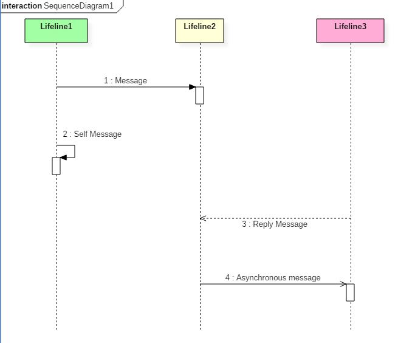

# Interaction, Collaboration, Sequence Diagrams with EXAMPLES

  - Details  
     Last Updated:
    06 February 2020

## What is Interaction diagram?

The interactions are simply units of the behavior of a classifier. This
classifier is known as context classifier, which provides the context
for interaction. An interaction is defined as a behavior that consists
of a group of messages exchanged among elements of accomplishing a
specific task in the system. An interaction may use any of the features
of its classifier context. It can use any of the classifier contexts
which it has access. The critical component in an interaction diagram is
lifeline and messages.

Interaction overview diagrams are provided by UML to establish
communication between objects. It does not manipulate the data
associated with the particular communication path. Interaction diagrams
mostly focus on message passing and how these messages make up one
functionality of a system. Interaction diagrams are designed to display
how the objects will realize the particular requirements of a system.

Various UML elements typically own interaction diagrams. The details of
interaction can be shown using several notations such as sequence
diagram, timing diagram, communication/collaboration diagram.

Interaction diagrams capture the dynamic behavior of any system.

Following are the different types of interaction diagrams defined in
UML:

  - Sequence diagram
  - Collaboration diagram
  - Timing diagram

The purpose of a sequence diagram in UML is to visualize the sequence of
a message flow in the system. The sequence diagram shows the interaction
between two lifelines as a time-ordered sequence of events.

The collaboration diagram is also called as a communication diagram. The
purpose of a collaboration diagram is to emphasize structural aspects of
a system, i.e., how various lifelines in the system connects.

Timing diagrams focus on the instance at which a message is sent from
one object to another object.

**What You Will Learn:**
\[hide\]

[What is Interaction diagram?](#1)

[Purpose of an Interaction Diagram](#2)

[Important terminology](#3)

  - [Lifeline](#4)
  - [Messages](#5)
  - [State invariants and constraints](#6)
  - [Operator](#7)
  - [Iteration](#8)
  - [Branching](#9)

[Types of Interaction diagram and Notations](#10)

[Sequence Diagram](#11)

  - [Sequence diagram example](#12)
  - [Benefits of a Sequence Diagram](#13)
  - [Drawbacks of a sequence diagram](#14)

[What is the Collaboration diagram?](#15)

  - [Benefits of Collaboration Diagram](#16)
  - [Drawbacks of a Collaboration Diagram](#17)
  - [Collaboration diagram Example](#18)

[Timing diagram](#19)

  - [Timing diagram Example](#20)
  - [Benefits of a Timing Diagram](#21)
  - [Drawbacks of a Timing Diagram](#22)

[How to draw a Interaction diagram?](#23)

[Use of an interaction diagram](#24)

## Purpose of an Interaction Diagram

Interaction diagrams help you to visualize the interactive behavior of a
system. Interaction diagrams are used to represent how one or more
objects in the system connect and communicate with each other.

Interaction diagrams focus on the dynamic behavior of a system. An
interaction diagram provides us the context of an interaction between
one or more lifelines in the system.

In UML, the interaction diagrams are used for the following purposes:

  - Interaction diagrams are used to observe the dynamic behavior of a
    system.
  - Interaction diagram visualizes the communication and sequence of
    message passing in the system.
  - Interaction diagram represents the structural aspects of various
    objects in the system.
  - Interaction diagram represents the ordered sequence of interactions
    within a system.
  - Interaction diagram provides the means of visualizing the real time
    data via UML.
  - Interaction diagrams can be used to explain the architecture of an
    object-oriented or a distributed system.

## Important terminology

An interaction diagram contains lifelines, messages, operators, state
invariants and constraints.

### Lifeline

A lifeline represents a single participant in an interaction. It
describes how an instance of a specific classifier participates in the
interaction.

A lifeline represents a role that an instance of the classifier may play
in the interaction. Following are various attributes of a lifeline,

1.  Name
    1.  It is used to refer the lifeline within a specific interaction.
    2.  A name of a lifeline is optional.
2.  Type
    1.  It is the name of a classifier of which the lifeline represents
        an instance.
3.  Selector
    1.  It is a Boolean condition which is used to select a particular
        instance that satisfies the requirement.
    2.  Selector attribute is also optional.

The notation of lifeline is explained in the notation section.

### Messages

A message is a specific type of communication between two lifelines in
an interaction. A message involves following activities,

1.  A call message which is used to call an operation.
2.  A message to create an instance.
3.  A message to destroy an instance.
4.  For sending a signal.

When a lifeline receives a call message, it acts as a request to invoke
an operation that has a similar signature as specified in the message.
When a lifeline is executing a message, it has a focus of control. As
the interaction progresses over time, the focus of control moves between
various lifelines. This movement is called a flow of control.

Following are the messages used in an interaction diagram:

|                          |                                                                                                                 |
| ------------------------ | --------------------------------------------------------------------------------------------------------------- |
| **Message Name**         | **Meaning**                                                                                                     |
| **Synchronous message**  | The sender of a message keeps waiting for the receiver to return control from the message execution.            |
| **Asynchronous message** | The sender does not wait for a return from the receiver; instead, it continues the execution of a next message. |
| **Return message**       | The receiver of an earlier message returns the focus of control to the sender.                                  |
| **Object creation**      | The sender creates an instance of a classifier.                                                                 |
| **Object destruction**   | The sender destroys the created instance.                                                                       |
| **Found message**        | The sender of the message is outside the scope of interaction.                                                  |
| **Lost message**         | The message never reaches the destination, and it is lost in the interaction.                                   |

### State invariants and constraints

When an instance or a lifeline receives a message, it can cause it to
change the state. A state is a condition or a situation during a
lifetime of an object at which it satisfies some constraint, performs
some operations, and waits for some event.

In interaction diagram, not all messages cause to change the state of an
instance. Some messages do not the values of some attribute. It has no
side effects on the state of an object.

### Operator

An operator specifies an operation on how the operands are going to be
executed. The operators in UML supports operations on data in the form
of branching as well as an iteration. Various operators can be used to
ensure the use of iteration and branching in the UML model. The opt and
alt operators are used for branching operations. The loop operator is
used to ensure the iteration operations in which a condition is executed
repeatedly until the satisfying result is produced. Break operator is
used inside the loop or iteration operations. It ensures that the loop
is terminated whenever a break operator is encountered. If a break
condition is not specified, then the loop executes the infinite number
of times, which results in crashing the program.

Following are the operators used in an interaction diagram:

|              |             |                                                                                           |
| ------------ | ----------- | ----------------------------------------------------------------------------------------- |
| **Operator** | **Name**    | **Meaning**                                                                               |
| **Opt**      | Option      | An operand is executed if the condition is true. e.g., If else                            |
| **Alt**      | Alternative | The operand, whose condition is true, is executed. e.g., switch                           |
| **Loop**     | Loop        | It is used to loop an instruction for a specified period.                                 |
| **Break**    | Break       | It breaks the loop if a condition is true or false, and the next instruction is executed. |
| **Ref**      | Reference   | It is used to refer to another interaction.                                               |
| **Par**      | Parallel    | All operands are executed in parallel.                                                    |

### Iteration

In an interaction diagram, we can also show iteration using an iteration
expression. An iteration expression consists of an iteration specifier
and an optional iteration clause. There is no pre-specified syntax for
UML iteration.

In iteration to show that messages are being sent in parallel, parallel
iteration specifier is used. A parallel iteration specifier is denoted
by \*//. Iteration in UML is achieved by using the loop operator.

### Branching

In an interaction diagram, we can represent branching by adding guard
conditions to the messages. Guard conditions are used to check if a
message can be sent forward or not. A message is sent forward only when
its guard condition is true. A message can have multiple guard
conditions, or multiple messages can have the same guard condition.
Branching in UML is achieved with the help of alt and opt, operators.

These are some of the **most important** terminologies used in UML
interaction diagram.

## Types of Interaction diagram and Notations

Following are the different types of interaction diagrams defined in
UML:

  - Sequence diagram
  - Collaboration diagram
  - Timing diagram

The basic notation of interaction is a rectangle with a pentagon in the
upper left corner of a rectangular box.

## Sequence Diagram

  - The purpose of a sequence diagram in UML is to visualize the
    sequence of a message flow in the system.
  - The sequence diagram shows the interaction between two lifelines as
    a time-ordered sequence of events.
  - A sequence diagram is used to capture the behavior of any scenario.
  - A sequence diagram shows an implementation of a scenario in the
    system. Lifelines in the system take part during the execution of a
    system.
  - In a sequence diagram, a lifeline is represented by a vertical bar.
  - A message flow between two or more objects is represented using a
    vertical dotted line which extends across the bottom of the page.
  - In a sequence diagram, different types of messages and operators are
    used which are described above.
  - In a sequence diagram, iteration and branching are also used.

The above sequence diagram contains lifeline notations and notation of
various messages used in a sequence diagram such as a create, reply,
asynchronous message, etc.

### Sequence diagram example

The following sequence diagram example represents McDonald's ordering
system:

The ordered sequence of events in a given sequence diagram is as
follows:

1.  Place an order.
2.  Pay money to the cash counter.
3.  Order Confirmation.
4.  Order preparation.
5.  Order serving.

If one changes the order of the operations, then it may result in
crashing the program. It can also lead to generating incorrect or buggy
results. Each sequence in the above-given sequence diagram is denoted
using a different type of message. One cannot use the same type of
message to denote all the interactions in the diagram because it creates
complications in the system.

You must be careful while selecting the notation of a message for any
particular interaction. The notation must match with the particular
sequence inside the diagram.

### Benefits of a Sequence Diagram

  - Sequence diagrams are used to explore any real application or a
    system.
  - Sequence diagrams are used to represent message flow from one object
    to another object.
  - Sequence diagrams are easier to maintain.
  - Sequence diagrams are easier to generate.
  - Sequence diagrams can be easily updated according to the changes
    within a system.
  - Sequence diagram allows reverse as well as forward engineering.

### Drawbacks of a sequence diagram

  - Sequence diagrams can become complex when too many lifelines are
    involved in the system.
  - If the order of message sequence is changed, then incorrect results
    are produced.
  - Each sequence needs to be represented using different message
    notation, which can be a little complex.
  - The type of message decides the type of sequence inside the diagram.

## What is the Collaboration diagram?

A collaboration diagram is required to identify how various objects make
up the entire system. They are used to understand the object
architecture within a system rather than the flow of a message in a
sequence diagram. An object an entity that has various attributes
associated with it. It is a concept of object-oriented programming.
There are multiple objects present inside an object-oriented system
where each object can be associated with any other object inside the
system. Collaboration or communication diagrams are used to explore the
architecture of objects inside the system. The message flow between the
objects can be represented using a collaboration diagram.

### Benefits of Collaboration Diagram

  - It is also called as a communication diagram.
  - It emphasizes the structural aspects of an interaction diagram - how
    lifeline connects.
  - Its syntax is similar to that of sequence diagram except that
    lifeline don't have tails.
  - Messages passed over sequencing is indicated by numbering each
    message hierarchically.
  - Compared to the sequence diagram communication diagram is
    semantically weak.
  - Object diagrams are special case of communication diagram.
  - It allows you to focus on the elements rather than focusing on the
    message flow as described in the sequence diagram.
  - Sequence diagrams can be easily converted into a collaboration
    diagram as collaboration diagrams are not very expressive.
  - While modeling collaboration diagrams w.r.t sequence diagrams, some
    information may be lost.

The above collaboration diagram notation contains lifelines along with
connectors, self-loops, forward, and reverse messages used in a
collaboration diagram.

### Drawbacks of a Collaboration Diagram

  - Collaboration diagrams can become complex when too many objects are
    present within the system.
  - It is hard to explore each object inside the system.
  - Collaboration diagrams are time consuming.
  - The object is destroyed after the termination of a program.
  - The state of an object changes momentarily, which makes it difficult
    to keep track of every single change the occurs within an object of
    a system.

### Collaboration diagram Example

Following diagram represents the sequencing over student management
system:

The above collaboration diagram represents a student information
management system. The flow of communication in the above diagram is
given by,

1.  A student requests a login through the login system.
2.  An authentication mechanism of software checks the request.
3.  If a student entry exists in the database, then the access is
    allowed; otherwise, an error is returned.

## Timing diagram

Timing diagram does not contain notations as required in the sequence
and collaboration diagram. The timing diagram is merely just a waveform
or a graph which is used to describe the state of a lifeline at any
instance of time.

A timing diagram specifies how the object changes its state by using a
waveform or a graph. It is used to denote the transformation of an
object from one form into another form.

The flow between the software program at various instances of time is
represented using a waveform.

  - It is a proper representation of interactions that focuses upon the
    specific timings of messages sent between various objects.
  - Timing diagrams are used to explain the detailed time processing of
    a particular object.
  - Timing diagrams are used to explain how an object changes within its
    lifetime.
  - Timing diagrams are mostly used with distributed and embedded
    systems.
  - In UML, timing diagrams are read from left to right according to the
    name of a lifeline specified at the left edge.
  - Timing diagrams are used to represent various changes that occur
    within a lifeline from time to time.
  - Timing diagrams are used to display a graphical representation of
    various states of a lifeline per unit time.
  - UML provides various notations to simplify the transition state
    between two lifelines per unit time.

### Timing diagram Example

The timing diagram given below represents a few phases of a software
development life cycle.

In the above diagram, first, the software passes through the
requirements phase then the design and later the development phase. The
output of the previous phase at that given instance of time is given to
the second phase as an input. Thus, the timing diagram can be used to
describe SDLC (Software Development Life Cycle) in UML.

### Benefits of a Timing Diagram

  - Timing diagrams are used to represent the state of an object at a
    particular instance of time.
  - Timing diagram allows reverse as well as forward engineering.
  - Timing diagram can be used to keep track of every change inside the
    system.

### Drawbacks of a Timing Diagram

  - Timing diagrams are difficult to understand.
  - Timing diagrams are difficult to maintain.

## How to draw a Interaction diagram?

Interaction diagrams are used to represent the interactive behavior of a
system. Interaction diagrams focus on the dynamic behavior of a system.
An interaction diagram provides us the context of an interaction between
one or more lifelines in the system.

To draw an interaction diagram, you have first to determine the scenario
for which you have to draw an interaction diagram. After deciding the
situation, identify various lifelines that are going to be involved in
the interaction. Categorize all the lifeline elements and explore them
to identify possible connections and how the lifelines are related to
one another. To draw an interaction diagram, the following things are
required:

1.  The total number of lifelines that are going to be part of an
    interaction
2.  is a sequence of message flow within various objects of a system.
3.  Various operators to ease the functionality of an interaction
    diagram.
4.  Various types of messages to display the interaction more clearly
    and in a precise manner.
5.  The ordered sequence of messages.
6.  Organization and a structure of an object.
7.  Various time constructs of an object.

## Use of an interaction diagram

Interaction diagrams consist of a sequence diagram, collaboration
diagram, and timing diagrams. Following is the specific purpose of an
interaction diagram:

  - Sequence diagrams are used to explore any real application or a
    system.
  - Interaction diagrams are used to explore and compare the use of
    sequence, collaborations, and timing diagrams.
  - Interaction diagrams are used to capture the behavior of a system.
    It displays the dynamic structure of a system.
  - Sequence diagrams are used to represent message flow from one object
    to another object.
  - Collaboration diagrams are used to understand the object
    architecture of a system rather than message flow.
  - Interaction diagrams are used to model a system as a time-ordered
    sequence of events.
  - Interaction diagrams are used in reverse as well as forward
    engineering.
  - Interaction diagrams are used to organize the structure of
    interactive elements.

### Summary

  - The interactions are simply units of the behavior of a classifier.
  - The critical elements in an interaction diagram are lifeline and
    messages.
  - Interaction diagrams mostly focus on message passing.
  - Interaction diagrams capture the dynamic behavior of any system.
  - Interaction diagram contains sequence diagram, timing diagram,
    communication/collaboration diagram.
  - The sequence UML diagram is to visualize the sequence of a message
    flow in the system.
  - The purpose of a collaboration diagram is to emphasize structural
    aspects.
  - Timing diagrams focus on the instance at which a message is sent
    from one object to another object.

 

  - [
    Prev](/uml-activity-diagram.html "UML Activity Diagram: What is, Components, Symbol, EXAMPLE")
  - [Next
    ](/component-diagram-uml-example.html "Component Diagram: UML Tutorial with EXAMPLE")

