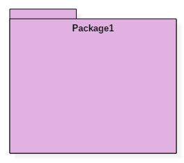

# UML Notation Tutorial: Symbol with Examples

  - Details  
     Last Updated:
    06 February 2020

## What is a model?

A **Model** is an abstraction of something to understand it before
building it. As modeling omits unimportant details, it is easier to
manipulate than the original entity. A model means organizing something
with a particular purpose.

A **model** is a simplification of reality.

A model may provide:

  - Blueprint of system
  - Organization of the system
  - Dynamic of the system

In this tutorial, you will learn

[What is a model?](#1)

[UML Building Blocks](#2)

[Things](#3)

  - [Structural things](#4)
  - [Behavioral things](#5)
  - [Grouping things](#6)
  - [Annotational things](#7)

[Relationships](#8)

  - [Association relationship](#9)
  - [Dependency relationship](#10)
  - [Generalization relationship](#11)
  - [Realization relationship](#12)

[Diagrams](#13)

  - [Structural diagrams](#14)
  - [Behavioral diagrams](#15)
  - [Interaction diagrams](#16)

## UML Building Blocks

UML stands for unified modeling language which revolves around various
blocks to generate a single model. Building blocks are the things
required to develop one full UML model diagram. It is an essential part
of every UML diagram. Following are the basic UML building blocks:

1.  Things
2.  Relationships
3.  Diagrams

Let us study in depth the building blocks of a UML diagram.

## Things

A thing can be described as any real-world entity or an object. Things
are divided into various categories in UML as follows,

  - Structural things
  - Behavioral things
  - Grouping things
  - Annotational things

### Structural things

A structural thing is used to describe the static part of a model. It is
used to represent the things that are visible to human eyes. Structural
things are all about the physical part of a system. It is the noun of a
UML model, such as a class, object, interface, collaboration, use case,
component, and a node.

Structural things consist of:

**Class:**

A class is used to represent various objects. It is used to define the
properties and operations of an object. In UML, we can also represent an
abstract class. A class whose functionalities are not defined is called
an abstract class. Any UML class notation is generally expressed as
follows,

**Object:**

An object is an entity which is used to describe the behavior and
functions of a system. The class and object have the same notations. The
only difference is that an object name is always underlined in UML.

The notation of any object in UML is given below.

**Interface:**

An interface is similar to a template without implementation details. A
circle notation represents it. When a class implements an interface, its
functionality is also implemented.

**Collaboration:**

It is represented by a dotted ellipse with a name written inside it.

**Use-case:**

Use-cases are one of the core concepts of object-oriented modeling. They
are used to represent high-level functionalities and how the user will
handle the system.

**Actor:**

It is used inside use case diagrams. The actor is an entity that
interacts with the system. A user is the best example of an actor. The
actor notation in UML is given below.

**Component:**

A component notation is used to represent a part of the system. It is
denoted in UML like given below,

**Node:**

A node is used to describe the physical part of a system. A node can be
used to represent a network, server, routers, etc. Its notation is given
below.

**Deployment diagram:**

It represents the physical hardware on which system is installed. A
deployment diagram represents the physical view of a system. It denotes
the communication and interaction between various parts of the system.

A deployment diagram consists of the following notations:

1.  A node
2.  A component
3.  An artifact
4.  An interface

### Behavioral things

They are the **verbs** of a UML model, such as interactions, activities
and state machines. Behavioral things are used to represent the behavior
of a system.

Behavioral things consist of:

**State machine:**

It used to describe various states of a single component throughout the
software development life cycle. It is used to capture different states
of a system component.

**Activity diagram:**

An activity diagram is used to represent various activities carried out
by different components of a system. It is denoted the same as that of
the state machine diagram.

Activity diagram mainly contains initial state, final state, a decision
box, and an action notation.

**Interaction diagram:**

Interaction diagrams are used to visualize the message flow between
various components of a system.

  - Sequence diagram: A sequence diagram shows interactions between one
    or more lifelines within real time.

The notation of a sequence diagram is given below,

### Grouping things

It is the package which is used to group semantically related modeling
elements into a single cohesive unit. The package is the only grouping
thing available in the UML.

### Annotational things

It is like a note, which may be written to the model to capture some
vital information. It is similar to the yellow sticky note.

## Relationships

The relationship allows you to show on a model how two or more things
relate to each other. The relationship in UML will enable you to capture
meaningful connections between things. It shows how each element is
associated with each other and how this association describes the
functionality of an application.

Relationships in UML are categorized as follows,

  - Association relationship
  - Dependency relationship
  - Generalization relationship
  - Realization relationship

### Association relationship

It is a set of links that connect elements of the UML model. It also
defines how many objects are taking part in that relation. It
illustrates how many elements are participating in a particular
interaction.

It is denoted as a dotted line with arrowheads on both sides. Both the
sides contain an element which describes the relationship. A new term
multiplicity is introduced that tells us how many objects of a
particular element are associated.

Association relationship is denoted as follows,

### Dependency relationship

In this kind of a relationship, the source element is dependent upon the
target element and may be affected by changes to it. It is one of the
most important notations of UML. It defines the direction of a
dependency from one object to another.

It is denoted by a dotted line with an arrow at one side.

Dependency relationship is denoted as follows,

### Generalization relationship

It is also called as a parent-child relationship. It is a relationship
between a general thing and a more specific kind of a thing. This type
of relationship is used to represent the inheritance concept.

It is denoted by a straight line with a hollow arrowhead at one side.

Generalization relationship is denoted as follows,

### Realization relationship

In this, one element describes some responsibility which is not
implemented and the other elements implement the functionality mentioned
by the first element. Realization relationship is widely used while
denoting **interfaces**.

It is denoted as a dotted line with a hollow arrowhead at one end.

Realization relationship is denoted as follows:

## Diagrams

UML diagrams are divided into three different categories such as,

1.  Structural diagram
2.  Behavioral diagram
3.  Interaction diagram

### Structural diagrams

Structural diagrams are used to represent a static view of a system. It
represents a part of a system that makes up the structure of a system. A
structural diagram shows various objects within the system.

Following are the various structural diagrams in UML:

  - Class diagram
  - Object diagram
  - Package diagram
  - Component diagram
  - Deployment diagram

### Behavioral diagrams

Any real-world system can be represented in either a static form or a
dynamic form. A system is said to be complete if it is expressed in both
the static and dynamic ways. The behavioral diagram represents the
functioning of a system.

UML diagrams that deals with the static part of a system are called
structural diagrams. UML diagrams that deals with the moving or dynamic
parts of the system are called behavioral diagrams.

Following are the various behavioral diagrams in UML:

  - Activity diagram
  - Use case diagram
  - State machine diagram

### Interaction diagrams

Interaction diagram is nothing but a subset of behavioral diagrams. It
is used to visualize the flow between various use case elements of a
system. Interaction diagrams are used to show an interaction between two
entities and how data flows within them.

Following are the various interaction diagrams in UML:

  - Timing diagram
  - Sequence diagram
  - Collaboration diagram

### Summary

  - A model is said to be an abstraction of a system that hides the
    implementation details.
  - It provides blueprint and structure of a system.
  - It helps us to define the structural and behavioral aspects of a
    system.
  - Things, relationships and diagrams are three building blocks of UML.
  - Thing is nothing but any real-world entity.
  - Relationships are used to describe the connection between one or
    more things.
  - Various UML diagrams are used to describe different aspects of a
    single system.

 

  - [
    Prev](/uml-diagrams.html "UML Diagrams: Versions, Types, History, Tools,  Examples")
  - [Next
    ](/uml-relationships-with-example.html "UML Relationships with EXAMPLE:  Dependency, Generalization, Realization")

