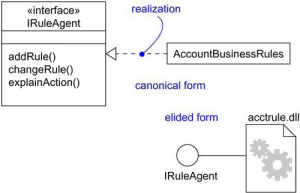

# UML Relationships with EXAMPLE: Dependency, Generalization, Realization

  - Details  
     Last Updated:
    06 February 2020

Relationships in UML are used to represent a connection between various
things. It is also called a link that describes how two or more things
can relate to each other during the execution of a system.

A relationship is a connection amongst things such as structural,
behavioral, or grouping things in the unified modeling language.

Following are the different types of standard relationships in UML,

  - **Association**

It is a set of links that connects elements of the UML model. It also
defines how many objects are taking part in that relation.

  - **Dependency**

In a dependency relationship, as the name suggests, two or more elements
are dependent on each other. In this kind of a relationship, if we make
a change to a particular element, then it is likely possible that all
the other elements will also get affected by the change.

  - **Generalization**

It is also called a parent-child relationship. In generalization, one
element is a specialization of another general component. It may be
substituted for it. It is mostly used to represent inheritance.

  - **Realization**

In a realization relationship of UML, one entity denotes some
responsibility which is not implemented by itself and the other entity
that implements them. This relationship is mostly found in the case of
**interfaces.**

In this UML tutorial, you will learn:

  - [Association](#2)
  - [Dependency](#3)
  - [Generalization](#4)
  - [Realization](#5)
  - [Composition](#6)
  - [Aggregation](#7)

## Association

It is a structural relationship that represents objects can be connected
or associated with another object inside the system. Following
constraints can be applied to the association relationship.

  - **{implicit}** – Implicit constraints specify that the relationship
    is not manifest; it is based upon a concept.
  - **{ordered}** – Ordered constraints specify that the set of objects
    at one end of an association are in a specific way.
  - **{changeable}** – Changeable constraint specifies that the
    connection between various objects in the system can be added,
    removed, and modified as per the requirement.
  - **{addOnly}** – It specifies that the new connections can be added
    from an object which is situated at the other end an association.
  - **{frozen}** – It specifies that when a link is added between two
    objects, then it cannot be modified while the frozen constraint is
    active on the given link or a connection.

We can also create a class that has association properties; it is called
as an association class.

### Reflexive association

The reflexive association is a subtype of association relationship in
UML. In a reflexive association, the instances of the same class can be
related to each other. An instance of a class is also said to be an
object.

Reflexive association states that a link or a connection can be present
within the objects of the same class.

Let us consider an example of a class fruit. The fruit class has two
instances, such as mango and apple. Reflexive association states that a
link between mango and apple can be present as they are instances of the
same class, such as fruit.

### Directed association

As the name suggests, the directed association is related to the
direction of flow within association classes.

In a directed association, the flow is directed. The association from
one class to another class flows in a single direction only.

It is denoted using a solid line with an arrowhead.

Example:

You can say that there is a directed association relationship between a
server and a client. A server can process the requests of a client. This
flow is unidirectional, that flows from server to client only. Hence a
directed association relationship can be present within servers and
clients of a system.

## Dependency

Using a dependency relationship in UML, one can relate how various
things inside a particular system are dependent on each other.
Dependency is used to describe the relationship between various elements
in UML that are dependent upon each other.

### Stereotypes

  - **«bind»** – Bind is a constraint which specifies that the source
    can initialize the template at a target location, using provided
    parameters or values.
  - **«derive»** – It represents that the location of a source object
    can be calculated from the target object.
  - **«friend»** – It specifies that the source has unique visibility in
    the target object.
  - **«instanceOf»** – It specifies that the instance of a target
    classifier is the source object.
  - **«instantiate»** – It specifies that the source object is capable
    of creating instances of a target object.
  - **«refine»** – It specifies that the source object has exceptional
    abstraction than that of the target object.
  - **«use»** – It is used when packages are created in UML. The use
    stereotype describes that the elements of a source package can be
    present inside the target package as well. It describes that the
    source package makes use of some elements of a target package.
  - **«substitute»** - specifies that the client may be substituted for
    the supplier at runtime.
  - **«access»** – It specifies that the source package access the
    elements of the target package **which is also called as a private
    merging.**
  - **«import»** – It specifies that the target can import the element
    of a source package like they are defined inside the **target which
    is also called as a public merging.**
  - **«permit»** - specifies that source element has access to the
    supplier element whatever the declared visibility of the supplier.
  - **«extend»** – Helps you to specifies that the target can extend the
    behavior of the source element.
  - **«include»** – Allows you to specifies the source element which can
    be included the behavior of another element at a specified location.
    (same as a function call in c/c++)
  - **«become»** – It specifies that the target is similar to the source
    with different values and roles.
  - **«call»** – It specifies that the source can invoke a target object
    method.
  - **«copy»** – It specifies that the target object is independent,
    copy of a source object.
  - **«parameter» - the** supplier is a parameter of the client
    operations**.**
  - **«send» -** the client is an operation that sends the supplier some
    unspecified target.

### Stereotypes among state machine

  - **«send»** – Specifies that the source operation sends the target
    event.

## Generalization

It is a relationship between a general entity and a unique entity which
is present inside the system.

In a generalization relationship, the object-oriented concept called
**inheritance** can be implemented. A generalization relationship exists
between two objects, also called as entities or things. In a
generalization relationship, one entity is a parent, and another is said
to be as a child. These entities can be represented using inheritance.

In inheritance, a child of any parent can access, update, or inherit the
functionality as specified inside the parent object. A child object can
add its functionality to itself as well as inherit the structure and
behavior of a parent object.

This type of relationship collectively known as a generalization
relationship.

### Stereotypes and their constraints

  - **«implementation»** – This stereotype is used to represent that the
    child entity is being implemented by the parent entity by inheriting
    the structure and behavior of a parent object without violating the
    rules.**Note** This stereotype if widely used in a singl**e
    inheritance**.

Generalization relationship contains constraints such as complete,
incomplete to check whether all the child entities are being included in
the relationship or not.

## Realization

In a realization relationship of UML, one entity denotes some
responsibility which is not implemented by itself and the other entity
that implements them. This relationship is mostly found in the case of
**interfaces.**

Realization can be represented in two ways:

  - Using a canonical form
  - Using an elided form

In the above diagram, account business rules realize the interface
IRuleAgent.

### Types of realization:

1.  Canonical form
    
    In a realization relationship of UML, the canonical form is used to
    realize interfaces across the system. It uses an interface
    stereotype to create an interface and realization relationship is
    used to realize the particular interface.
    
    In a canonical form, the realization relationship is denoted using
    the dashed directed line with a sizeable open arrowhead.
    
    In the above diagram, interface Iruleagent is realized using an
    object called as Account Business Rules.

2.  Elided form
    
    Realization in the UML class diagram can also be shown using an
    elided form. In an elided form, the interface is denoted using a
    circle which is also called as a lollipop notation.
    
    This interface, when realized using anything present inside the
    system, creates an elided structure.
    
    In the above diagram, the interface Iruleagent is denoted using an
    elided form which is being realized by acctrule.dll.

## Composition

It is not a standard UML relationship, but it is still used in various
applications.

Composite aggregation is a subtype of aggregation relation with
characteristics as:

  - it is a two-way association between the objects.
  - It is a whole/part relationship.
  - If a composite is deleted, all other parts associated with it are
    deleted.

Composite aggregation is described as a binary association decorated
with a filled black diamond at the aggregate (whole) end.

A folder is a structure which holds n number of files in it. A folder is
used to store the files inside it. Each folder can be associated with
any number of files. In a computer system, every single file is a part
of at least one folder inside the file organization system. The same
file can also be a part of another folder, but it is not mandatory.
Whenever a file is removed from the folder, the folder stays un-affected
whereas the data related to that particular file is destroyed. If a
delete operation is executed on the folder, then it also affects all the
files which are present inside the folder. All the files associated with
the folder are automatically destroyed once the folder is removed from
the system.

This type of relationship in UML is known by composite aggregation
relationship.

## Aggregation

An aggregation is a subtype of an association relationship in UML.
Aggregation and composition are both the types of association
relationship in UML. An aggregation relationship can be described in
simple words as " an object of one class can own or access the objects
of another class."

In an aggregation relationship, the dependent object remains in the
scope of a relationship even when the source object is destroyed.

Let us consider an example of a car and a wheel. A car needs a wheel to
function correctly, but a wheel doesn't always need a car. It can also
be used with the bike, bicycle, or any other vehicles but not a
particular car. Here, the wheel object is meaningful even without the
car object. Such type of relationship is called an aggregation relation.

## Summary

  - Relationship in UML allows one thing to relate with other things
    inside the system.
  - An association, dependency, generalization, and realization
    relationships are defined by UML.
  - Composition relationship can also be used to represent that object
    can be a part of only one composite at a time.
  - Association is used to describe that one object can be associated
    with another object.
  - Dependency denotes that objects can be dependent on each other.
  - A realization is a meaningful relationship between classifiers.
  - Generalization is also called as a parent-child relationship.

 

  - [
    Prev](/uml-notation-symbol.html "UML Notation Tutorial: Symbol with Examples")
  - [Next
    ](/association-aggregation-composition-difference.html "UML Association vs Aggregation vs Composition with EXAMPLE")

