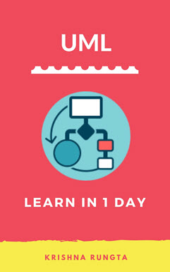

# UML Tutorial for Beginners PDF

  - Details  
     Last Updated:
    23 January 2020

This eBook is a step by step guide to learn UML. This eBook covers
topics like Use Case, Object Diagram, Component Diagram, State Diagram,
Activity Diagram, etc.

## Key Highlights of UML Tutorial PDF are

  - 127+ pages
  - eBook Designed for beginners
  - Beautifully annotated screenshots
  - You will get lifetime access

### Inside this PDF

1.  UML Diagrams: Versions, Types, History, Tools, Examples
2.  UML Notation Tutorial: Symbol with Examples
3.  UML Relationships with EXAMPLE: Dependency, Generalization,
    Realization
4.  UML Association vs Aggregation vs Composition with EXAMPLE
5.  UML Class Diagram Tutorial with Examples
6.  What is UML Object Diagram? Tutorial with Example
7.  UML Use Case Diagram: Tutorial with EXAMPLE
8.  State Machine Diagram: UML Tutorial with EXAMPLE
9.  UML Activity Diagram: What is, Components, Symbol, EXAMPLE
10. Interaction, Collaboration, Sequence Diagrams with EXAMPLES
11. Component Diagram: UML Tutorial with EXAMPLE
12. Deployment Diagram: UML Tutorial with EXAMPLE

  

Want alternative payment options? Contact us
[here](javascript:void\(%20window.open\(%20'https://form.jotform.me/81911628533458',%20'blank',%20'scrollbars=yes,%20toolbar=no,%20width=700,%20height=500'%20\)%20\)%20)

 

  - [
    Prev](/best-uml-tools.html "BEST 28 UML Tools in 2020")
